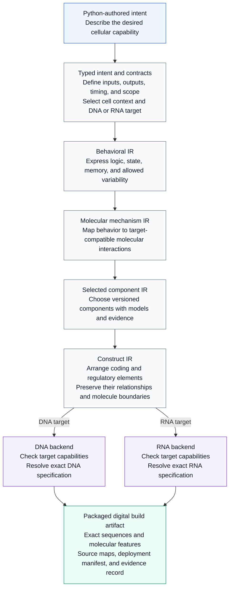

# CellWeave

A compiler architecture for turning an immune cell engineer's Python-authored intent into an exact, traceable DNA or RNA payload specification.

**Status: initial scaffold.** The repository defines module boundaries, shared interface types, and a small architecture-inspection CLI. It does not implement a biological DSL, lowering passes, component selection, sequence generation, or biological validation. The code contains no therapeutic sequences or characterized biological component library.

## Planned compiler stack

CellWeave is designed to turn a description of **what an engineered immune cell should do** into an exact specification of **what its genetic payload must contain**. Each layer resolves more implementation detail while carrying the original requirements forward. The diagram shows the intended architecture; the current scaffold exposes stages and interfaces only.



**IR** means *intermediate representation*: an explicit description of the same design at a particular level of detail.

- **Preserve meaning across every arrow.** Compiler passes must carry requirements, context assumptions, and source correspondence forward. Checks distinguish exact structural facts, model-conditional results, empirical support, and unresolved obligations.
- **Use a defined biological context.** The selected cell context, payload modality, versioned component registry, and quantitative models constrain design choices throughout the stack. DNA and RNA are distinct targets chosen before mechanism selection.
- **Emit an inspectable digital package.** The final artifact connects its exact molecular specification back to the engineer's intent. Exact sequence identity and confidence in biological behavior remain separate claims. Physical manufacture and in-vivo execution are downstream of this compiler.

## Repository layout

```text
src/cellweave/
  frontend/       Python authoring and elaboration
  ir/             Intermediate representations and compilation stages
  semantics/      Contracts, types, context, and observable meaning
  compiler/       Pass interfaces and pipeline orchestration
  synthesis/      Candidate generation and constrained optimization
  verification/   Independent checks and evidence records
  registry/       Versioned components and their evidence
  models/         Quantitative models and context snapshots
  backends/
    dna/          DNA-specific capability checks and emission
    rna/          RNA-specific capability checks and emission
  artifacts/      Source maps, manifests, and build packaging
  interop/        Future SBOL/SBML adapters
docs/             Architecture, roadmap, and decisions
examples/         Authoring examples as the DSL develops
tests/            Unit, semantic, and integration test boundaries
data/             Registry/model fixture policy; no biological library yet
.github/workflows/  Hosted package smoke checks
```

## Inspect the scaffold

Requires Python 3.11 or newer. No runtime dependencies are needed.

```bash
PYTHONDONTWRITEBYTECODE=1 PYTHONPATH=src python3 -m cellweave --version
PYTHONDONTWRITEBYTECODE=1 PYTHONPATH=src python3 -m cellweave architecture
```

For an editable installation in an existing Python development environment:

```bash
python -m pip install -e .
cellweave architecture
```

The CLI describes the planned architecture; it does not compile a payload. Hosted CI checks package installation and CLI imports on Python 3.11 and 3.14. Semantic validation will be added alongside implemented compiler passes.

## Design documents

- [Architecture and preservation obligations](docs/architecture.md)
- [Implementation roadmap](docs/roadmap.md)
- [Initial architecture decision](docs/decisions/0001-explicit-contracts-and-staged-compilation.md)
- [Contributor instructions](AGENTS.md)
