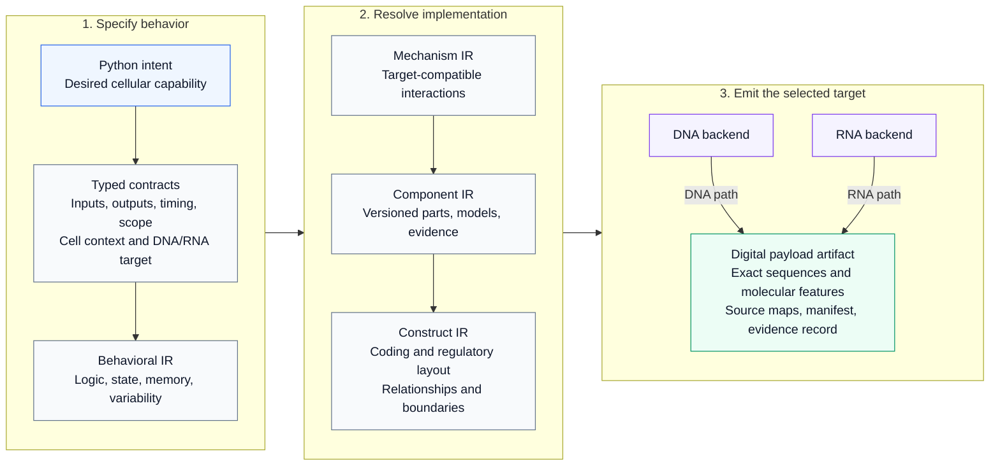

# CellWeave

A compiler architecture for turning an immune cell engineer's Python-authored intent into an exact, traceable DNA or RNA payload specification.

**Status: frozen build requests, checked passes, automatic synthetic generation and curated CDS references, v0.1 alpha.** Author cell roles, recognition, actions, temporal logic, memory, states, feedback, and communication; export immutable, typed intent graphs as JSON. Checked lowering preserves source requirements in Behavior IR. A reference evaluator executes supported behavior against supplied histories. Explicit response contracts can now be checked against an independently executed synthetic candidate model, producing scoped results, counterexamples, and dependency identities. Frozen requests make input bindings authoritative. A checked pass manager generates a narrow combinational synthetic implementation and verifies it independently. A small offline catalog locks synthetic operators; separately curated FAP-CAR references pin exact CDS expectations. Molecular lowering, full component linking, sequence generation and biological simulation remain future work.

## Planned compiler stack

CellWeave is designed to turn a description of **what an engineered immune cell should do** into an exact specification of **what its genetic payload must contain**. Each layer resolves more implementation detail while carrying the original requirements forward. The diagram shows the intended architecture. Python authoring, frozen requests, intent/behavior graphs, checked passes, abstract execution and automatic combinational synthetic realization are implemented; molecular realization and payload emission remain planned.



**IR** means *intermediate representation*: an explicit description of the same design at a particular level of detail.

- **Preserve meaning across every arrow.** Compiler passes must carry requirements, context assumptions, and source correspondence forward. Checks distinguish exact structural facts, model-conditional results, empirical support, and unresolved obligations.
- **Use a defined biological context.** The selected cell context, payload modality, versioned component registry, and quantitative models constrain design choices throughout the stack. DNA and RNA are distinct targets chosen before mechanism selection.
- **Emit an inspectable digital package.** The final artifact connects its exact molecular specification back to the engineer's intent. Exact sequence identity and confidence in biological behavior remain separate claims. Physical manufacture and in-vivo execution are downstream of this compiler.

## Intended users and design responsibilities

CellWeave is being designed for **payload-discovery and immune-cell-engineering teams** in biotechnology companies, pharmaceutical research organizations, and academic or translational laboratories. Its primary hands-on users would be **synthetic biologists, cell engineers, molecular/payload-design scientists, and computational biologists** working together to turn a desired cellular capability into an inspectable genetic design.

Some users would author Python specifications and work directly with compiler diagnostics. Others would contribute biological requirements, component evidence, or implementation constraints and review the resulting design. The roles below describe the intended collaboration model; they are not separate stages that every organization assigns to separate people.

| Role | Contribution to payload design | Intended interaction with CellWeave |
| --- | --- | --- |
| Immunologists and disease-area biologists | Define the target cell, desired response, relevant biological context, and meaningful functional readouts. | Define and review the intent, observables, and behavioral contracts. |
| Synthetic biologists, immune-cell engineers, and molecular/payload-design scientists | Design the encoded mechanism and genetic construct architecture. | Primary design authors: specify capabilities, inspect proposed implementations, and refine constraints. |
| Protein, RNA, and gene-engineering specialists | Develop the encoded components, expression architecture, and sequence-level implementation. | Supply component definitions and evidence; review construct and molecular specifications. |
| Computational biologists, biological modelers, and scientific software engineers | Formalize specifications, model behavior, compare candidates, and make design workflows reproducible. | Author Python workflows, maintain models and registries, and inspect preservation checks and provenance. |
| Delivery and vector engineers | Define compatibility with the chosen carrier, payload format, target-cell access, and platform constraints. | Contribute target capabilities and packaging constraints early; review deployment specifications. |
| Translational, assay-development, and process-development scientists | Relate designs to measurable activity, experimental evidence, and manufacturability. | Contribute evidence and acceptance criteria; review the build record and unresolved assumptions. |

### Who is responsible for a new genetic payload?

Payload design is a **multidisciplinary R&D responsibility**, with titles and ownership varying by organization. Day-to-day construct design commonly sits within cell-engineering, molecular biology, synthetic biology, or gene/RNA-engineering groups. A scientific program lead or academic principal investigator coordinates the broader effort, while specialists share responsibility for component behavior, delivery compatibility, and the evidence supporting the design.

For concrete examples of job functions, BMS describes a [Principal Scientist in Engineered Cell Therapy Discovery](https://bristolmyerssquibb.wd5.myworkdayjobs.com/BMS/job/Principal-Scientist--Engineered-Cell-Therapy-Discovery_R1605462) as designing genetic constructs and coordinating wet-lab, computational, and clinical collaborators. Kite describes a [Research Scientist in Molecular Biology](https://gilead.wd1.myworkdayjobs.com/es/kitepharmacareers/job/United-States---California---Foster-City/Research-Scientist---Molecular-Biology_R0053231-1) as supporting the design, generation, and evaluation of constructs for engineered T-cell therapies. These illustrate construct-design roles across cell therapy; they do not imply that every such role focuses on in-vivo engineering.

Within in-vivo engineering specifically, the author-contribution statement in [Rurik et al., *CAR T cells produced in vivo to treat cardiac injury*](https://doi.org/10.1126/science.abm0594) distinguishes project and experimental design from lipid-nanoparticle design and production. This illustrates why the genetic payload and its delivery system require coordinated expertise.

CellWeave's intended role is to give this team a shared, traceable design artifact: the biological intent, the selected implementation, the exact molecular specification, and the supporting assumptions and evidence. Scientific ownership of those choices remains with the development team.

## Python intent API

The [v0.1 API reference](docs/intent-api-v0.1.md) covers the authoring language and its semantics. Six [executable examples](examples/intent_programs.py) demonstrate recognition, memory, phases, pulses, graded responses, feedback, and cooperating populations.

```python
import cellweave as cw

therapy = cw.Therapy("local_response")
cells = therapy.engineer("responders", cell_type="T_cell")
recognized = cells.contact.marker("A").high()
context = cells.environment.signal("disease_context").present()
cells.when(recognized & context).do(
    cells.eliminate(cells.contact),
    cells.secrete("local_support_factor"),
)

program = therapy.freeze()
print(program.summary())
# Save an inspectable source artifact; this is not a nucleic-acid payload.
from pathlib import Path
Path("intent.json").write_text(program.to_json(), encoding="utf-8")
```

Biological labels in these examples are symbolic design concepts. Python constructs the program description; it does not execute cellular behavior. Scope and dimensional checks catch authoring mistakes while names and parameters can remain unresolved for later design work.

## Execute an abstract behavior specification

`cw.lower_to_behavior(program)` binds design parameters and produces an immutable, versioned `BehaviorProgram`. `cw.evaluate(behavior, history, until=...)` evaluates one engineered cell against complete, timestamped observation snapshots. Contact observations have explicit object identities; temporal deadlines execute between snapshots; state changes are atomic. The [behavior example](examples/behavior_trace.py) demonstrates the workflow.

The [execution semantics](docs/behavior-semantics-v0.1.md) define the supported profile and its limits. Qualitative observations are supplied explicitly. Unsupported operators produce source-linked diagnostics. The evaluator reports requested actions; it does not predict molecular dynamics or modify the external world.

## Check a candidate against the intended behavior

Define the intended output endpoint, active and inactive ranges, response deadlines, allowed input domain, and target context. Connect a candidate's ports through an explicit observation map. `cw.check_realization(...)` executes the behavior and synthetic model independently, then returns `pass`, `fail`, `unknown`, or `unsupported` for the supplied history.

The [realization example](examples/realization_check.py) checks a responsive candidate, a silent candidate, and a late candidate, and demonstrates evidence becoming stale after a model change. The [contract specification](docs/realization-checking-v0.1.md) explains timing, contact identity, coverage, and claim boundaries. A passing result supports the checked finite history under the recorded assumptions; it does not establish a molecular implementation or all-input correctness.

## Freeze and run a checked synthetic build

Freeze `BuildRequest` before lowering, then bind the authored response contract and operating domain in a `RealizationRequest`. `run_synthetic_pipeline(request, history, until=...)` generates a candidate, checks it with the independent model runner and returns an explicitly scoped result with unresolved molecular obligations. The [checked example](examples/checked_pipeline.py) demonstrates the complete flow and automatic rejection of stale evidence after a catalog change.

The [request contract](docs/build-requests-v0.1.md), [pass manager](docs/pass-manager-v0.1.md) and [supported synthetic profile](docs/synthetic-profile-v0.1.md) describe the acceptance boundaries. When verifying legacy `lower_to_behavior(intent, parameters=...)` output, retain the request or provide the original `parameters` to `verify_lowering`; output bindings cannot authorize an override.

## Repository layout

```text
src/cellweave/
  frontend/       Python authoring and elaboration
  ir/             Intermediate representations and compilation stages
  semantics/      Contracts, types, context, and observable meaning
  compiler/       Pass interfaces and pipeline orchestration
  synthesis/      Candidate generation and constrained optimization
  verification/   Independent checks and evidence records
  registry/       Versioned components and their evidence
  models/         Quantitative models and context snapshots
  backends/
    dna/          DNA-specific capability checks and emission
    rna/          RNA-specific capability checks and emission
  artifacts/      Source maps, manifests, and build packaging
  interop/        Future SBOL/SBML adapters
docs/             Architecture, roadmap, and decisions
examples/         Authoring examples as the DSL develops
tests/            Unit, semantic, and integration test boundaries
data/             Small curated CDS references and their source/review records
.github/workflows/  Hosted package smoke checks
```

## Run the API and CLI

Requires Python 3.11 or newer. No runtime dependencies are needed.

```bash
PYTHONDONTWRITEBYTECODE=1 PYTHONPATH=src python3 -m cellweave --version
PYTHONDONTWRITEBYTECODE=1 PYTHONPATH=src python3 -m cellweave architecture
PYTHONDONTWRITEBYTECODE=1 PYTHONPATH=src python3 examples/intent_programs.py
PYTHONDONTWRITEBYTECODE=1 PYTHONPATH=src python3 examples/behavior_trace.py
PYTHONDONTWRITEBYTECODE=1 PYTHONPATH=src python3 examples/realization_check.py
PYTHONDONTWRITEBYTECODE=1 PYTHONPATH=src python3 examples/checked_pipeline.py
PYTHONDONTWRITEBYTECODE=1 PYTHONPATH=src python3 -m unittest discover -s tests -v
```

For an editable installation in an existing Python development environment:

```bash
python -m pip install -e .
cellweave architecture
```

Use `cellweave inspect artifact.json` for a saved intent, behavior, mechanism, contract, domain, context, observation map, or check record, or add `--json` to print the normalized artifact. Inspection reads JSON and does not execute authoring scripts. Hosted CI is configured to check package installation, the API test suite, examples, and CLI on Python 3.11 and 3.14.

`cw.plan(program, profile=...)` returns a planning report with typed parameter bindings and unresolved choices. `cw.compile(plan)` explicitly raises `CompilationUnavailableError`: this release does not emit DNA/RNA sequences.

## Design documents

- [Python intent API: v0.1](docs/intent-api-v0.1.md)
- [Behavior execution semantics: v0.1](docs/behavior-semantics-v0.1.md)
- [Realization contracts and checking: v0.1](docs/realization-checking-v0.1.md)
- [Toolchain contracts and future obligations](docs/toolchain-contracts.md)
- [Architecture and preservation obligations](docs/architecture.md)
- [Authoritative development roadmap](docs/roadmap.md)
- [Frozen build requests](docs/build-requests-v0.1.md)
- [Checked pass manager](docs/pass-manager-v0.1.md)
- [Synthetic generation profile](docs/synthetic-profile-v0.1.md)
- [Exact coding-sequence reference benchmarks and curation plan](docs/reference-benchmarks.md)
- [Initial architecture decision](docs/decisions/0001-explicit-contracts-and-staged-compilation.md)
- [Contributor instructions](AGENTS.md)
