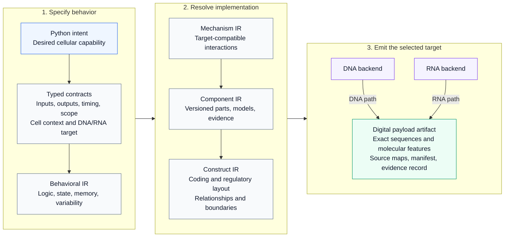

# CellWeave

A compiler architecture for turning an immune cell engineer's Python-authored intent into an exact, traceable DNA or RNA payload specification.

**Status: initial scaffold with a draft intent API.** The repository defines module boundaries, shared interface types, a small architecture-inspection CLI, and a proposed Python authoring interface. It does not implement a biological DSL, lowering passes, component selection, sequence generation, or biological validation. The code contains no therapeutic sequences or characterized biological component library.

## Planned compiler stack

CellWeave is designed to turn a description of **what an engineered immune cell should do** into an exact specification of **what its genetic payload must contain**. Each layer resolves more implementation detail while carrying the original requirements forward. The diagram shows the intended architecture; the current scaffold exposes stages and interfaces only.



**IR** means *intermediate representation*: an explicit description of the same design at a particular level of detail.

- **Preserve meaning across every arrow.** Compiler passes must carry requirements, context assumptions, and source correspondence forward. Checks distinguish exact structural facts, model-conditional results, empirical support, and unresolved obligations.
- **Use a defined biological context.** The selected cell context, payload modality, versioned component registry, and quantitative models constrain design choices throughout the stack. DNA and RNA are distinct targets chosen before mechanism selection.
- **Emit an inspectable digital package.** The final artifact connects its exact molecular specification back to the engineer's intent. Exact sequence identity and confidence in biological behavior remain separate claims. Physical manufacture and in-vivo execution are downstream of this compiler.

## Intended users and design responsibilities

CellWeave is being designed for **payload-discovery and immune-cell-engineering teams** in biotechnology companies, pharmaceutical research organizations, and academic or translational laboratories. Its primary hands-on users would be **synthetic biologists, cell engineers, molecular/payload-design scientists, and computational biologists** working together to turn a desired cellular capability into an inspectable genetic design.

Some users would author Python specifications and work directly with compiler diagnostics. Others would contribute biological requirements, component evidence, or implementation constraints and review the resulting design. The roles below describe the intended collaboration model; they are not separate stages that every organization assigns to separate people.

| Role | Contribution to payload design | Intended interaction with CellWeave |
| --- | --- | --- |
| Immunologists and disease-area biologists | Define the target cell, desired response, relevant biological context, and meaningful functional readouts. | Define and review the intent, observables, and behavioral contracts. |
| Synthetic biologists, immune-cell engineers, and molecular/payload-design scientists | Design the encoded mechanism and genetic construct architecture. | Primary design authors: specify capabilities, inspect proposed implementations, and refine constraints. |
| Protein, RNA, and gene-engineering specialists | Develop the encoded components, expression architecture, and sequence-level implementation. | Supply component definitions and evidence; review construct and molecular specifications. |
| Computational biologists, biological modelers, and scientific software engineers | Formalize specifications, model behavior, compare candidates, and make design workflows reproducible. | Author Python workflows, maintain models and registries, and inspect preservation checks and provenance. |
| Delivery and vector engineers | Define compatibility with the chosen carrier, payload format, target-cell access, and platform constraints. | Contribute target capabilities and packaging constraints early; review deployment specifications. |
| Translational, assay-development, and process-development scientists | Relate designs to measurable activity, experimental evidence, and manufacturability. | Contribute evidence and acceptance criteria; review the build record and unresolved assumptions. |

### Who is responsible for a new genetic payload?

Payload design is a **multidisciplinary R&D responsibility**, with titles and ownership varying by organization. Day-to-day construct design commonly sits within cell-engineering, molecular biology, synthetic biology, or gene/RNA-engineering groups. A scientific program lead or academic principal investigator coordinates the broader effort, while specialists share responsibility for component behavior, delivery compatibility, and the evidence supporting the design.

For concrete examples of job functions, BMS describes a [Principal Scientist in Engineered Cell Therapy Discovery](https://bristolmyerssquibb.wd5.myworkdayjobs.com/BMS/job/Principal-Scientist--Engineered-Cell-Therapy-Discovery_R1605462) as designing genetic constructs and coordinating wet-lab, computational, and clinical collaborators. Kite describes a [Research Scientist in Molecular Biology](https://gilead.wd1.myworkdayjobs.com/es/kitepharmacareers/job/United-States---California---Foster-City/Research-Scientist---Molecular-Biology_R0053231-1) as supporting the design, generation, and evaluation of constructs for engineered T-cell therapies. These illustrate construct-design roles across cell therapy; they do not imply that every such role focuses on in-vivo engineering.

Within in-vivo engineering specifically, the author-contribution statement in [Rurik et al., *CAR T cells produced in vivo to treat cardiac injury*](https://doi.org/10.1126/science.abm0594) distinguishes project and experimental design from lipid-nanoparticle design and production. This illustrates why the genetic payload and its delivery system require coordinated expertise.

CellWeave's intended role is to give this team a shared, traceable design artifact: the biological intent, the selected implementation, the exact molecular specification, and the supporting assumptions and evidence. Scientific ownership of those choices remains with the development team.

## Draft Python intent API

The [v0.1 API proposal](docs/intent-api-v0.1.md) describes cell roles, recognition, actions, memory, changing behavioral phases, graded outputs, feedback, and communication between populations. Its central authoring form is `cells.when(condition).do(actions)`. The document includes example programs and a signature reference; these are proposed interfaces, not callable package features yet.

## Repository layout

```text
src/cellweave/
  frontend/       Python authoring and elaboration
  ir/             Intermediate representations and compilation stages
  semantics/      Contracts, types, context, and observable meaning
  compiler/       Pass interfaces and pipeline orchestration
  synthesis/      Candidate generation and constrained optimization
  verification/   Independent checks and evidence records
  registry/       Versioned components and their evidence
  models/         Quantitative models and context snapshots
  backends/
    dna/          DNA-specific capability checks and emission
    rna/          RNA-specific capability checks and emission
  artifacts/      Source maps, manifests, and build packaging
  interop/        Future SBOL/SBML adapters
docs/             Architecture, roadmap, and decisions
examples/         Authoring examples as the DSL develops
tests/            Unit, semantic, and integration test boundaries
data/             Registry/model fixture policy; no biological library yet
.github/workflows/  Hosted package smoke checks
```

## Inspect the scaffold

Requires Python 3.11 or newer. No runtime dependencies are needed.

```bash
PYTHONDONTWRITEBYTECODE=1 PYTHONPATH=src python3 -m cellweave --version
PYTHONDONTWRITEBYTECODE=1 PYTHONPATH=src python3 -m cellweave architecture
```

For an editable installation in an existing Python development environment:

```bash
python -m pip install -e .
cellweave architecture
```

The CLI describes the planned architecture; it does not compile a payload. Hosted CI checks package installation and CLI imports on Python 3.11 and 3.14. Semantic validation will be added alongside implemented compiler passes.

## Design documents

- [Python intent API: v0.1 draft](docs/intent-api-v0.1.md)
- [Architecture and preservation obligations](docs/architecture.md)
- [Implementation roadmap](docs/roadmap.md)
- [Initial architecture decision](docs/decisions/0001-explicit-contracts-and-staged-compilation.md)
- [Contributor instructions](AGENTS.md)
