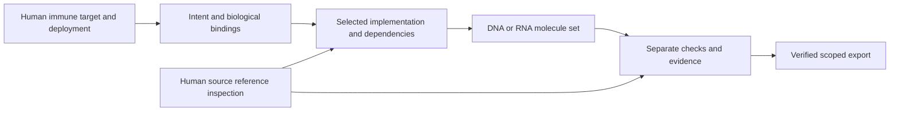

# Human circuit profile contracts

R0 establishes scope, authority and claim boundaries for the
[human immune circuit plan](rna-circuit-reproduction-plan.md), under
[decision 0005](decisions/0005-human-immune-circuit-profiles.md). Molecular
compilation and publication reference admission remain later milestones.

## Scope and authority

The sole product target is human immune-cell engineering in vivo, with an
explicit DNA or RNA payload form. A typed immune identity is required in addition
to the existing HumanTargetContext. It is bound to the exact target and subtype
claim, rather than inferred from a name such as `T_cells`. This checks a declared
recipient contract; physical recipient identity and suitability still need
applicable evidence.

Human source experiments have their own context: cell identity/state, system,
compartment, delivery/expression mode, source identity and locator. A human
non-immune cell line can establish a bounded reference context. It cannot replace
the product target or discharge an immune/in-vivo deployment requirement.

At R0 a request fixes its declared DNA/RNA modality and exact-reproduction or
candidate-design mode. Original material identity, topology, chemistry and
processing forms require R1/R3 authority; a mode declaration alone does not
establish any of them. Exact reproduction must not optimize or substitute parts.
A candidate-design request is tied to the human immune target and cannot silently
reuse changed reference evidence. Component origins remain provenance; recipient
scope is checked independently.

All public check/import paths use immutable, versioned request objects with
strict JSON fields. Boundary checks must be repeated at planning, selection,
verification and export under current policy. An assessment is a historical
record; only a fresh comparison against independently retained expected-request
authority confirms its current consistency.

## Independent claims

| Dimension | R0 result boundary |
| --- | --- |
| Declared scope | Check human target/reference purpose, recipient binding and molecular form. |
| Base fidelity | Unassessed; no sequence has been emitted or compared. |
| Source nominal specification | Unassessed; no source-defined chemistry/feature comparison. |
| Complete exact nominal molecule | Unassessed; no complete-molecule reconstruction. |
| Mechanism correspondence | Unassessed; no implemented circuit family yet. |
| Model support | Unassessed; no predictive model evaluated. |
| Experimental correspondence | Unassessed; context/source declarations are not reviewed experimental evidence. |
| Human therapeutic admission | Not admitted; scope acceptance supplies no biological eligibility. |

PASS/FAIL/UNKNOWN/UNSUPPORTED remain distinct. Declared-scope acceptance cannot
populate the other dimensions; the R0 assessment outcome is `UNSUPPORTED`.
Complete nominal identity will require all mandatory bases,
chemistry and ends resolved; a faithful source-described distribution is a
different result from one exact individual molecule. Missing data never becomes
a default value or a passing result.

## Public API and CLI

`CircuitProfileRequest` preserves the full original human source wrapper when
one is supplied. `ImmuneRecipientIdentity` binds a typed `ImmuneLineage` to both
the target fingerprint and its cell-subtype claim fingerprint. It records a
declaration, not an experimentally established recipient classification.
`HumanExperimentContext` separately describes the source experiment and requires
source pins, an exact locator and assay-condition declarations.

`check_circuit_profile(request)` returns a strict `CircuitProfileAssessment`.
`verify_circuit_profile(assessment, expected_request=request)` rechecks against
the complete independently retained request and current versions. A saved
assessment and a hash copied from it cannot supply this authority. All five
boundaries (`import`, `planning`, `selection`, `verification`, `export`) are
represented and checked. These are scope checks, not an implemented molecule
selection/export operation. `compile(request)` raises
`CompilationUnavailableError` with the unresolved obligations.

The executable example produces both product and illustrative reference requests:

```sh
python examples/circuit_profile.py --output generated/circuit-profile
biocompiler circuit-profile-check --request generated/circuit-profile/product.request.json --output generated/circuit-profile/assessment.json
biocompiler circuit-profile-verify generated/circuit-profile/assessment.json --expected-request generated/circuit-profile/product.request.json
biocompiler inspect generated/circuit-profile/assessment.json
```

Successful check/verify CLI exit status means the declared scope or assessment
consistency was checked. The printed molecular result remains `UNSUPPORTED` and
human admission remains `not_admitted`. Invalid scope, tampering or changed
expected authority fails; publication never overwrites the input request.
The example's reference context is a software fixture, not publication evidence.

Imports reject duplicate/unknown fields, incompatible enums and nonfinite JSON.
Request imports are bounded to 1 MB UTF-8, 20,000 tree items and depth 64; text
fields are bounded to 16 KiB, experiment sources to 16 and assay conditions to
32. Assessments allow 2 MB and at most 32 diagnostics of 1,024 characters each.
The implementation's stricter nested authority limits also apply. Version
changes require fresh verification, even when old records remain inspectable.

## Frozen initial inventory policy

Policy identity: `biocompiler.human_circuit_inventory_policy.v0.1`.
R0 fixes the collection scope and review rules, not the truth of uncurated source
records. R1 must resolve actual construct and experiment IDs before admission.

| Inventory family ID | Required human-study coverage |
| --- | --- |
| `wroblewska_2015_mrna` | Published modified-mRNA circuit implementations and their complete transcript inventories. |
| `matsuura_2018_mrna` | AND/OR/NAND/NOR/XOR, three-input AND and distinct human-tested output/construct variants. |
| `post_polya_human` | Fujita 2022 and Masaki 2025 human ON and combined ON/OFF experiments. |
| `adar_human` | CellREADR and RADAR human sensing and reported logic cases; keep study/form identities distinct. |
| `promitar_human` | Human IRES logic and separately identified circular-RNA experiments. |
| `abe_2025_split_protein` | Human split-protein AND/NOR/asymmetric and three-input variants. |
| `liu_2018_rna_control` | Human RNA-mediated translational gates, including noncoding regulators and XNOR. |

These IDs identify curation work, not selectable or admitted biological parts.
The [plan's source matrix](rna-circuit-reproduction-plan.md#required-benchmark-collection)
links the studies and distinguishes DNA-expressed RNA from delivered RNA.

For each family R1 must retain a reviewed case inventory. Every case contains the
publication/correction version, exact construct/experiment IDs and locators,
human cell context, input encodings, readouts, all circuit molecules, experimental
inputs/controls, source coverage, molecular form, chemistry/end certainty and
transfer obligations to the intended immune deployment. Mixed-species papers
contribute only their human cases and the source records necessary to identify
those materials.

Changes to scope or case membership require a new inventory version, an explicit
reason and a retained comparison with the previous inventory. Do not remove an
incomplete case to make the corpus appear complete. A partially specified case
can be inspected, but its unresolved fidelity scopes remain incomplete.

## Source retention and review policy

1. Retain original source bytes where redistribution is permitted, with immutable
   content hashes, source/version metadata and precise locators. Record the
   applicable reuse terms; public accessibility alone does not establish reuse
   rights. Restricted author records may remain local and explicitly unavailable
   to a public CI corpus.
2. Keep component/recipe authority separate from final-molecule expectations.
   Preserve extraction coordinates, alphabet conventions, transformations,
   discrepancies and narrowly justified normalizations.
3. Independently extract/reconcile the final expectations from original source
   material. A second reviewer records what was checked and any remaining gaps;
   copying a generated sequence or accepting its hash is not independent review.
   Automated/agent review is identified as such, never represented as review by
   the original researchers or an experiment.
4. Resolve contradictions and corrections before promoting affected scopes.
   Promoter/template maps and primer lists alone do not establish mature RNA
   boundaries, cap, tail or chemical identity. Explicitly partial records retain
   these missing fields.
5. Record raw observations, digitizations and qualitative interpretation
   separately. Preserve actual assay, timing, normalization and uncertainty.
   Fitting data and independent model evaluation are separate collections.
6. Retrieval is a curation operation. Ordinary compilation and CI consume pinned
   offline authority; they do not fetch live records or execute source files.
   Import/review of author-supplied records follows the same rules. Contacting
   researchers is outside current messaging authorization.

## Early workflow design and review

The low-fidelity structure below is an R0 design contract. It is not a screenshot
or an implemented replacement for the current studio.



| Workspace area | Always visible | Details on selection |
| --- | --- | --- |
| Purpose/context | Human immune payload or subordinate human reference; exact requested form | Original target and source-experiment context, each labeled separately. |
| Intent/bindings | Input entities/quantities, output meaning and required response | Python source, truth-table rows, observation thresholds and unresolved requirements. |
| Implementation | Mechanism family and every required molecule/provider | Linked interactions, exact library pins and reasons for rejected alternatives. |
| Molecules | Complete named inventory, topology and completeness | Annotated bases, overlapping features, processing forms, chemistry and source locators. |
| Verification | Independent claim dimensions and blockers | Current boundary, expected authority, diagnostics and supporting evidence. |
| Saved builds/export | Request identity and explicit export scope | Source/material changes, evidence invalidation and fresh verification. |

Review decisions against the researcher tasks:

- Exact reference reproduction opens a pinned case with its actual experiment
  context. It does not manufacture an in-vivo immune experiment to satisfy a UI.
- The main product flow retains the original immune target throughout. There is
  no organism picker or conversion of reference context into deployment context.
- An AND-to-OR edit or a material change invalidates exact reproduction. Candidate
  design is an explicit new request, with its own identity and evidence needs.
- A logical node can map to several molecules; the molecule list must never be
  collapsed into a single cassette to fit a diagram.
- Unknown chemistry and missing observations remain visible. Model plots require
  actual supported model/data; sequence equality is not a functional success badge.
- Every graph has a keyboard-accessible table alternative. Imported code is not
  executed by inspection, and unsupported visual edits preserve the original
  request in a read-only form. R12 supplies implemented browser acceptance.

This adapts the [Cello-inspired plan](rna-circuit-reproduction-plan.md#cello-inspired-uiux-workstream)
to the fixed human immune target. Bacterial libraries, promoter units and
organism-specific models are not part of the implementation contract.

## Invalidation and completion

Changing source records, target, recipient identity, source-experiment context,
molecular form, material identity or policy/checker version invalidates dependent
results. A fresh checker needs independent complete expected-request authority;
imported success flags never grant acceptance. Existing schemas remain unchanged.

R0 is complete only after contract/import, scope/refusal, authority-mutation and
claim-boundary tests pass, public checking/inspection is exercised, and hosted
validation records the exact revision/platform. The later R1–R13 gates remain
open; this contract alone cannot emit a biological payload.
