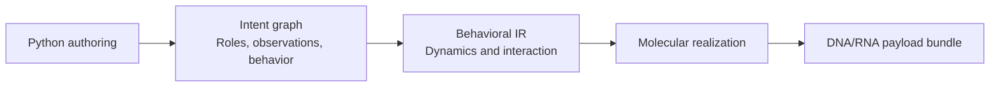

# CellWeave intent API: v0.1

**Status:** implemented authoring API, 2026-09-29, package `0.1.0.dev2`. Authoring, typed intent/behavior graphs, JSON inspection, parameter-binding reports, and abstract behavior execution are available. Molecular realization and DNA/RNA emission are not implemented. This API version is independent of the package version.

CellWeave lets an immune-cell engineer describe an evolving therapeutic behavior and refine it into DNA or RNA payload specifications for engineering cells **in vivo**. The author describes participating cell roles, what they perceive, how they respond, what they remember, and how they work together.

The primary authoring sentence is:

```python
cells.when(condition).do(action_one, action_two)
```

The API is designed to express a broad range of therapeutic intent. Molecular realization is a separate stage: a well-formed intent can be drafted and inspected before its mechanisms or sequences are selected.

## 1. A first program

All biological names in these examples are symbolic. They illustrate the language rather than prescribe a therapeutic construct. Each full example creates its own therapy; shorter fragments explicitly extend an earlier example.

```python
import cellweave as cw

therapy = cw.Therapy("context_aware_response")
responders = therapy.engineer("responders", cell_type="T_cell")

target = responders.contact
local = responders.environment

recognized = (
    target.marker("A").high()
    & (target.marker("B").present() | target.marker("C").present())
)
disease_context = local.signal("disease_context").present()

responders.when(
    recognized & disease_context,
    name="local_clearance",
).do(
    responders.eliminate(target),
    responders.secrete("local_support_factor"),
)
```

`engineer()` declares a cell role to be established inside the body. The rule is a program for each cell in that role. `target` denotes that cell's current contacted target, and `local` denotes its surroundings. Using the same target handle binds the marker combination and the elimination action to the same encounter.

The two actions share a condition and are enabled together. Python statement order does not make one biological action finish before the other starts.

## 2. Therapeutic intent the language should accommodate

| Design dimension | Examples of intent | Vocabulary |
| --- | --- | --- |
| Participants | T-cell, NK-cell, macrophage, regulatory, antigen-presenting, or antibody-producing roles | `Therapy`, `engineer()`, `CellProgram` |
| Recognition | A marker combination, a quantitative signature, tissue identity, an internal cell condition | Scoped signals, `Signature`, comparisons |
| Decisions | AND, OR, inhibition, thresholds, counting matching conditions, weighted integration | `Condition`, `Quantity`, expression operators |
| Therapeutic effects | Target elimination, engulfment, secretion, immune modulation, presentation, tissue restoration | Actions and reusable behavior libraries |
| Response magnitude | Graded output, pulses, saturation, regulation toward a desired range | Outputs, response curves, controllers |
| History | Sustained exposure, a previous encounter, ordered events, accumulated stimulation | Temporal expressions, events, memory |
| Behavioral phases | Searching, primed, active, resting, resolving, surveilling | State variables and state-changing actions |
| Cell lifestyle | Migration, retention, expansion, differentiation, persistence, contraction | Cell behavior libraries |
| Cooperation | Local alerts, recruitment, division of labor, coordinated responses | Channels, role-specific programs |
| External interaction | Molecular or physical commands, adjustable activity, reporting | External inputs, reporter outputs |

These dimensions compose. The API is not organized around a particular receptor family or a fixed catalog of therapy recipes.

## 3. Core object model

| Object | Meaning |
| --- | --- |
| `Therapy` | Owns the complete design: cell roles, parameters, communication, goals, and named definitions. |
| `CellProgram` | The program assigned to one cell population or functional role. |
| `Scope` / target handle | Identifies where an observation comes from or where an action is directed. |
| `Signal[T]` / `Quantity[T]` | A symbolic observation or a quantitative expression derived from observations. |
| `Condition` | A symbolic predicate, including a predicate involving time. |
| `Event` | An occurrence, such as a condition becoming true. |
| `Action` | A description of a requested cellular action; constructing it does not install a rule. |
| `Rule` | Associates a condition or event with actions. |
| `Memory` / `State` | Retained information and explicit behavioral phases. |
| Output (`Secretion`) | A named, controllable biological output, such as secretion of a product. |
| `Controller` | An objective for adjusting an output in response to an observed quantity. |
| `Channel` | A communication relationship between cell roles. |
| `Signature` | A named, reusable recognition expression bound to an observation scope. |
| `Parameter[T]` | A named design choice whose value can be supplied later. |

These semantic objects share an underlying graph representation. They describe cell behavior without selecting molecular parts.

### Scope through ordinary object access

```python
# Extends the first example.
target_marker = responders.contact.marker("A")
local_signal = responders.environment.signal("inflammation")
internal_signal = responders.internal.signal("activation_state")
external_command = responders.external.signal("activity_command")
```

- `contact`: the current encounter target, including its surface markers.
- `environment`: the executing cell's local extracellular context.
- `internal`: the executing cell's own state.
- `external`: a designated externally supplied input, perceived by that cell.

There is no implicit therapy-wide clock, shared memory, or globally synchronized phase. Shared behavior is expressed through communication or declared inputs. Tissue and spatial relationships can be refined through scope definitions without replacing the rule syntax.

### Quantities and predicates

`present()`, `high()`, and `low()` produce conditions. They preserve named qualitative thresholds for later refinement. A signal name or a qualitative band is a valid design concept; it need not immediately name a molecular sensor.

Numeric comparisons and arithmetic produce symbolic expressions too:

```python
# Extends the first example.
threshold = therapy.parameter("activation_threshold", type=cw.Level)
activation = responders.internal.signal("activation", type=cw.Level)
strong_activation = activation > threshold

two_of_three = cw.at_least(
    2,
    target.marker("A").present(),
    target.marker("B").present(),
    target.marker("C").present(),
)
```

`cw.Level` is a dimensionless scalar, useful for normalized or initially abstract signals. Physical quantities can use explicit dimensions such as `cw.Concentration`, `cw.SurfaceDensity`, `cw.Duration`, and `cw.ProductionRate`. Refinement of an abstract level into a physical observation retains the mapping between them.

Conditions compose with `&`, `|`, and `~`. Quantities support arithmetic and comparison. Parentheses make compositions readable. Python `and`, `or`, `not`, and `if` are not biological operators; symbolic expressions cannot be coerced to Python booleans.

## 4. Recognition and reusable behavior

A signature is an ordinary Python function that returns a condition. The decorator adds a name and source identity. Binding it to a scope makes reuse explicit.

```python
import cellweave as cw

@cw.signature
def pathological(target):
    return (
        target.marker("A").high()
        & (target.marker("B").present() | target.marker("C").present())
    )

def install_local_clearance(cells, *, context):
    return cells.when(
        pathological(cells.contact) & context,
        name="local_clearance",
    ).do(
        cells.eliminate(cells.contact),
        cells.secrete("local_support_factor"),
    )

therapy = cw.Therapy("reusable_response")
responders = therapy.engineer("responders", cell_type="T_cell")
install_local_clearance(
    responders,
    context=responders.environment.signal("disease_context").present(),
)
```

Calling `pathological(other_cells.contact)` binds the same pattern to another role's encounter. It does not reuse an observation from the first role.

Python functions can return expressions or actions, or install a reusable subprogram. Names are scoped to their owning role; larger repeated subprograms can use a name prefix supplied as a function argument. A behavior library can contribute recognition patterns, immune-modulation programs, tissue programs, and coordination routines through these same interfaces.

## 5. Time, events, memory, and phases

The author uses `when()` for a behavior enabled while a condition holds, and `on()` for a response to an occurrence:

```python
# Extends the first example.
responders.when(disease_context).do(
    responders.secrete("local_support_factor")
)

responders.on(disease_context.became_true()).do(
    responders.report("encounter_started")
)
```

This fragment illustrates two rule forms; installing it alongside the first example would add another secretion request, rather than replace the original rule. Replacement is always explicit.

| Expression | Intended meaning |
| --- | --- |
| `condition.held_for(duration)` | The condition has remained true for the specified interval. |
| `condition.recently(within=duration)` | It is true now or was true within the preceding interval. |
| `condition.became_true()` | An event on a false-to-true transition. |
| `event_a.followed_by(event_b, within=duration)` | An event at B when preceded by A within the interval. |
| `quantity.integrated(over=duration)` | A rolling accumulation of a quantity over an interval. |

Temporal evaluation starts when the cell's program is initialized. Windows contain only observed history since initialization; `held_for()` requires a full interval. An initially true condition produces an onset event. More specialized event pairing or timing policies can extend these nodes without changing their basic types.

An event can also start a timed behavior:

```python
# Extends the first example.
pulse_duration = therapy.parameter("pulse_duration", type=cw.Duration)
responders.on(disease_context.became_true()).do(
    responders.secrete("pulse_factor").for_(pulse_duration)
)
```

`for_()` attaches a duration to an ongoing action. Repeated triggers of the same pulse extend its end to that duration after the latest trigger; they do not create independent copies of the output. An event-triggered ongoing action without an explicit duration leaves duration as a design choice, rather than implying indefinite activity. Event reactions such as reporting an occurrence or assigning state do not require a duration.

### Priming memory

```python
import cellweave as cw

therapy = cw.Therapy("primed_response")
cells = therapy.engineer("responders", cell_type="T_cell")
dwell = therapy.parameter("priming_duration", type=cw.Duration)

disease = cells.environment.signal("disease_context").present()
recovery = cells.environment.signal("recovery").high()
recognized = cells.contact.marker("target_marker").present()

primed = cells.memory(
    "primed",
    set_when=disease.held_for(dwell),
    reset_when=recovery,
)

cells.when(primed.is_set() & recognized, name="primed_clearance").do(
    cells.eliminate(cells.contact)
)
```

`memory()` creates a per-cell retained Boolean, initially clear. An onset of `set_when` sets it; an initially true setting condition counts as an onset. It remains set after that condition disappears, until reset or expiry. Reset takes precedence whenever `reset_when` is true. An optional `duration` expires the memory after that interval from its latest setting onset. An input that stays true does not restart the timer or re-set an expired memory; a new onset is needed.

The separate `recently()` expression covers a trailing memory window without declaring a retained bit.

### Changing therapeutic phases

```python
# Extends the primed-response example.
phase = cells.state(
    "phase",
    values=("searching", "active", "recovering"),
    initial="searching",
)

cells.when(phase.is_("searching") & primed.is_set()).do(
    phase.set("active")
)
cells.when(phase.is_("active") & recovery).do(
    phase.set("recovering")
)
cells.when(phase.is_("recovering")).do(
    cells.rest()
)
```

`phase.set()` describes an idempotent state assignment. Conditions observe the prior state; resulting transitions do not acquire priority from Python statement order. If different rules can assign incompatible values at the same time, that arbitration is a visible design choice. The v0.1 behavior profile resolves it by rejecting a conflicting simultaneous assignment; identical typed writes coalesce. State updates commit atomically and propagate through same-time microsteps.

Adding a phase does not implicitly gate earlier rules. To restrict clearance to the active phase, author its guard as `phase.is_("active") & primed.is_set() & recognized` instead of the earlier clearance guard.

## 6. Multiple actions, graded outputs, and feedback

Actions include immediate effect requests and ongoing capabilities. Their action definitions specify which interpretation applies. Constructing `cells.secrete(...)` returns an action specification; a rule or controller must attach it to the program.

The v0.1 vocabulary includes:

| Action or behavior | Intent |
| --- | --- |
| `eliminate(target)` | Direct a cytotoxic response toward an encountered target. |
| `engulf(target)` | Direct a phagocytic response toward an encountered target. |
| `secrete(product, rate=...)` | Produce and release a named product. |
| `present(antigen)` | Present a named antigen. |
| `emit(channel)` | Produce a communication output. |
| `migrate_toward(signal)` | Bias migration along an observed spatial signal. |
| `retain(location)` | Maintain residence in a declared location. |
| `expand()`, `rest()`, `differentiate(state)` | Request changes to the cell's functional lifecycle. |
| `report(label)` | Produce an observable indication of an event or state. |

The `cells` object owns each of these operations. Their availability and realization can vary by cell role. Domain libraries can expose larger intents such as local tolerance, immune recruitment, or support for tissue repair as inspectable programs that expand into observations, actions, and goals. Such programs do not have one hardcoded molecular interpretation.

### Addressable outputs

A named output is useful when several parts of the design refer to the same effector. The following is a complete graded-response example:

```python
import cellweave as cw

therapy = cw.Therapy("graded_local_response")
cells = therapy.engineer("regulators", cell_type="regulatory_T_cell")

inflammation = cells.environment.signal("inflammation", type=cw.Level)
rate_map = therapy.parameter(
    "secretion_response",
    type=cw.Curve[cw.Level, cw.ProductionRate],
)
resolution = cells.secretion("resolution", product="resolution_factor")

cells.when(inflammation.high()).do(
    resolution.produce(rate=rate_map(inflammation))
)
```

`secretion()` declares an output handle; `produce()` returns an action; `resolution.rate` is its controllable quantity. `cells.secrete(product)` is shorthand for an action on an automatically named secretion output with an unspecified design rate. Repeated shorthand for the same product refers to that same default output; separately named outputs remain distinct.

Curve objects support graded, thresholded, saturating, or other relationships. They can begin as symbolic parameters and later receive a particular shape and parameters. The input and output dimensions remain explicit.

### Feedback toward a desired condition

This is an alternative complete program, using feedback instead of a specified input-output curve:

```python
import cellweave as cw

therapy = cw.Therapy("local_resolution")
cells = therapy.engineer("regulators", cell_type="regulatory_T_cell")

inflammation = cells.environment.signal("inflammation", type=cw.Level)
desired = therapy.parameter("desired_inflammation", type=cw.Level)
resolution = cells.secretion("resolution", product="resolution_factor")

cells.regulate(
    "resolve_inflammation",
    observed=inflammation,
    target=desired,
    actuator=resolution.rate,
    effect="decrease_observed",
)
```

This says to adjust the output to bring the observed quantity toward the target. `effect` declares the intended direction of the actuator's influence; it does not select a particular molecular controller. A target can also be a typed interval. An optional `when` condition limits when the controller operates.

A response curve maps an input directly to an output. A controller expresses a desired feedback relationship. Both remain distinct in the intent graph. Multiple controllers or rules that write the same output retain their identities; arbitration is explicit rather than inferred from source order.

## 7. Cooperating cell populations

```python
import cellweave as cw

therapy = cw.Therapy("coordinated_response")
scouts = therapy.engineer("scouts", cell_type="macrophage")
responders = therapy.engineer("responders", cell_type="NK_cell")
alert = therapy.channel("disease_alert", scope="local", type=cw.Level)

scouts.when(
    scouts.environment.signal("tissue_damage").high(),
    name="announce_damage",
).do(
    scouts.emit(alert)
)

responders.when(
    responders.receives(alert)
    & responders.contact.marker("target_marker").present(),
    name="alerted_response",
).do(
    responders.eliminate(responders.contact)
)
```

`channel()` declares a communication relationship; it does not choose a signaling molecule. `receives()` is a presence condition in the receiver's local context. `sense(channel)` returns its quantitative local observation for graded responses. `environment.gradient(channel)` exposes its local spatial direction and variation for migration:

```python
# Extends the coordinated-response example.
responders.when(responders.receives(alert)).do(
    responders.migrate_toward(responders.environment.gradient(alert))
)
```

This is a biological signal relationship, not a software message queue with exactly-once delivery.

Each role has its own observations, memory, state, and rules. Cross-role influence travels through declared channels. The eventual artifact can contain multiple payload specifications, with a mapping from payload components to intended recipient roles; a therapy need not collapse into one sequence.

## 8. Goals, refinement, and build targets

Behavioral rules answer what cells should do. Goals describe what the designer wants the complete intervention to accomplish:

```python
# Extends the coordinated-response example.
therapy.goal("reduce_local_pathology")
therapy.goal("support_recovery")
```

A goal initially records named therapeutic intent. It can later be refined into observable objectives or a reusable behavior program. Adding a goal does not silently install actions.

Parameters and biological definitions can likewise remain symbolic while the design is explored. Authoring and inspection should work before all values are selected. Subsequent refinements bind values, signatures, sensors, effectors, and context while preserving their source identities.

The build workflow supplies a profile containing the molecular target and context. The interface reuses `TargetContext` and `PayloadFormat`:

```python
import cellweave as cw
from cellweave.semantics.context import PayloadFormat, TargetContext

profile = cw.BuildProfile(
    target=TargetContext(
        context_id="example_context",
        context_version="1",
        payload_format=PayloadFormat.RNA,
    ),
)
```

This identifier is illustrative, not a supplied biological context. A context snapshot must describe the roles used by the program. A build profile selects DNA or RNA before mechanism selection; modality can therefore guide refinement while the behavioral source stays recognizable. The first profile describes one modality for a build, including a build with multiple same-modality payloads. Mixed-modality packages are a future profile extension.

The molecular workflow exposes three stages; the first two return inspectable records. Behavior lowering and reference execution are a separate, target-independent path described in the [behavior semantics](behavior-semantics-v0.1.md):

```python
# Uses the coordinated-response therapy and the profile above.
program = therapy.freeze()                 # Immutable IntentProgram.
design = cw.plan(program, profile=profile)  # RealizationPlan.
try:
    artifact = cw.compile(design)          # Future molecular compiler boundary.
except cw.CompilationUnavailableError as exc:
    print(exc)
```

`freeze()` preserves the authored intent and symbolic parameters. `plan()` validates supplied parameter bindings, retains defaults, and reports unbound parameters and other unresolved design choices. It does not select molecular mechanisms or parts. `compile()` currently raises `CompilationUnavailableError`; future molecular compilation will emit sequences and molecular specifications. Physical formulation and manufacture remain outside this interface.

A profile can supply typed values without changing the authored snapshot:

```python
# Creates a separate program for this build.
import cellweave as cw
from cellweave.semantics.context import PayloadFormat, TargetContext

therapy = cw.Therapy("timed_response")
cells = therapy.engineer("responders", cell_type="T_cell")
window = therapy.parameter("window", type=cw.Duration)
cue = cells.environment.signal("cue").present()
cells.when(cue.held_for(window)).do(cells.report("sustained_cue"))
profile = cw.BuildProfile(
    target=TargetContext("example_context", "1", PayloadFormat.RNA),
    parameters={"window": cw.Duration(5, unit="min")},
)
design = cw.plan(therapy.freeze(), profile=profile)
print(design.to_json())
```

The duration above illustrates units, not a therapeutic timing recommendation. Physical values use typed constructors such as `Duration(5, unit="min")` or `Concentration(1, unit="nM")`; raw numbers represent dimensionless `Level`. `Interval(lower, upper, type=...)` describes a range. Concrete `Curve(points=..., input=..., output=...)` values describe piecewise linear or step responses and can bind curve parameters. Named duration parameters may stay unresolved during authoring; known non-positive time windows and bindings that make a window non-positive are rejected.

## 9. Signature reference

This is a compact signature index, not an executable stub file. `T`, `U`, and `S` denote generic types; `Expr[T]` includes compatible signals, parameters, and derived quantities. Ellipses denote optional or extensible arguments.

```text
Therapy(name: str)
  engineer(name: str, *, cell_type: str) -> CellProgram
  parameter(name: str, *, type: Type[T] = Level, default: T | None = None) -> Parameter[T]
  channel(name: str, *, scope: str, type: Type[T] = Level) -> Channel[T]
  goal(name: str, ...) -> Goal
  freeze() -> IntentProgram

CellProgram
  contact: ContactScope
  environment: EnvironmentScope
  internal: InternalScope
  external: ExternalScope
  when(condition: Condition, *, name: str | None = None) -> RuleBuilder
  on(event: Event, *, name: str | None = None) -> RuleBuilder
  memory(name: str, *, set_when: Condition, reset_when: Condition | None = None,
         duration: Expr[Duration] | None = None) -> Memory
  state(name: str, *, values: Sequence[S], initial: S) -> State[S]
  secretion(name: str, *, product: str) -> Secretion
  regulate(name: str, *, observed: Expr[T], target: Expr[T] | Expr[Interval[T]],
           actuator: ControlPort[U], effect: str,
           when: Condition | None = None) -> Controller
  receives(channel: Channel[T]) -> Condition
  sense(channel: Channel[T]) -> Signal[T]
  eliminate(target: ContactScope) -> Action
  engulf(target: ContactScope) -> Action
  secrete(product: str, *, rate: Expr[ProductionRate] | None = None) -> Action
  present(antigen: str) -> Action
  emit(channel: Channel[T], ...) -> Action
  migrate_toward(signal: SpatialSignal[T]) -> Action
  retain(location: str | Scope) -> Action
  expand() -> Action
  rest() -> Action
  differentiate(state: str) -> Action
  report(label: str) -> Action

RuleBuilder.do(*actions: Action) -> Rule
ContactScope.marker(name: str) -> Signal[SurfaceDensity]
Scope.signal(name: str, *, type: Type[T] = Level) -> Signal[T]
EnvironmentScope.gradient(source: Channel[T] | Signal[T]) -> SpatialSignal[T]
Signal.present() / high() / low() -> Condition
Condition.held_for(duration: Expr[Duration]) -> Condition
Condition.recently(*, within: Expr[Duration]) -> Condition
Condition.became_true() -> Event
Event.followed_by(other: Event, *, within: Expr[Duration]) -> Event
Quantity[T].integrated(*, over: Expr[Duration]) -> Quantity[T * Duration]
Memory.is_set() -> Condition
State[S].is_(value: S) -> Condition
State[S].set(value: S) -> Action
Action.for_(duration: Expr[Duration]) -> Action
Secretion.produce(*, rate: Expr[ProductionRate] | None = None) -> Action
Secretion.rate: ControlPort[ProductionRate]
Parameter[Curve[T, U]].__call__(input: Expr[T]) -> Expr[U]
cw.at_least(count: int, *conditions: Condition) -> Condition
cw.signature(function: Callable[..., Condition]) -> Signature
BuildProfile(target: TargetContext, parameters: Mapping[str, Any] = ...) -> BuildProfile
cw.plan(program: IntentProgram, *, profile: BuildProfile) -> RealizationPlan
cw.compile(design: RealizationPlan) -> raises CompilationUnavailableError (future PayloadArtifact)
```

Action constructors return inert specifications. `do()` installs a rule, while `engineer()`, `memory()`, `state()`, `secretion()`, and `regulate()` declare named program entities. Unattached expressions and action specifications do not change cellular behavior. Re-declaring a named entity with a different definition is not an implicit update.

## 10. What compilation preserves

The frontend constructs a typed behavior graph, not Python bytecode intended to run in a cell. The initial graph contains roles, scopes, observations, expressions, parameters, state, actions, rules, outputs, controllers, channels, and goals.



Every node retains an identity within the authored graph and a source location. `program.nodes` and nested metadata are immutable; `to_dict()` returns an independent mutable copy. `IntentProgram.from_json(program.to_json())` restores the snapshot, including its sources. The loader checks schema, references, structural cycles, and typed records; it does not simulate the program.

`program.fingerprint` is a deterministic SHA-256 of the structural snapshot, excluding source locations. It is not a test of biological or logical equivalence: different construction histories or node identities may yield different fingerprints. `program.find(kind="rule")` and `program.summary()` support inspection. Unattached action expressions are pruned from snapshots, while declared entities such as outputs retain their identity without becoming active.

Subsequent lowering must preserve:

- **Who:** the executing role and the subject of each observation or action.
- **What:** the meaning of signals, recognition patterns, actions, and goals.
- **When:** conditions, events, temporal relationships, and retained state.
- **How much:** quantitative relationships, units, output magnitudes, and controller targets.
- **Together:** concurrent behaviors and communication between roles.

These are the bridge from readable therapeutic intent to molecular implementation. Exact payload identity, modeled behavior, and experimental support remain separate records in the existing compiler architecture.

## 11. Implementation status

The v0.1 release implements the complete authoring vocabulary in this reference: roles, scopes, signals, types, parameters, signatures, conditions, events, memory, state, actions, outputs, feedback specifications, and channels. Six [executable example programs](../examples/intent_programs.py) cover the main combinations. Tests check ownership, units, temporal metadata, named definitions, immutable serialization, and planning bindings.

The graphs retain the broad authoring vocabulary. `lower_to_behavior()` implements the executable subset defined in the [behavior semantics](behavior-semantics-v0.1.md); `evaluate()` runs its abstract specification against supplied histories. This is not a biological time-course simulator. Controllers, spatial/multicell transport and other unsupported operators receive explicit lowering diagnostics. Named biological concepts are not automatically assigned sensors or effectors. The next molecular work is a modeled realization path governed by the [toolchain contracts](toolchain-contracts.md).

See [architecture](architecture.md) for compiler stages and [roadmap](roadmap.md) for implementation sequencing.
