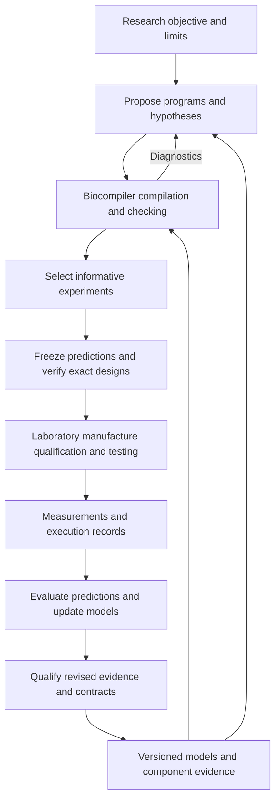

# Biocompiler product vision and integration roadmap

Product direction established 2026-10-08.

Biocompiler should be useful as a standalone tool for researchers and drug
developers now, and become a dependable compilation layer in AI-directed,
closed-loop biological research laboratories over time. We expect agents to
become its principal callers. Build toward that deployment through interfaces
that also improve today's researcher workflow: explicit programs, reproducible
inputs, precise diagnostics, independently checked outputs, and inspectable
evidence.

**Develop one compiler and verification core for both uses. Deliver useful
standalone capabilities first; introduce laboratory integration through
versioned adapters when there is a concrete workflow to support.** A lab,
agent provider, hosted service, or experimental result must not become a new
dependency of ordinary local compilation under supplied contracts.

This direction supplements the existing implementation plans. It establishes
design priorities and future milestone exits; it does not mark those milestones
implemented, reopen completed work, or expand the supported therapeutic profiles.

## Product purpose and deployment horizons

The product translates programmatically specified therapeutic behavior into
exact RNA payload specifications for human immune cells engineered in vivo,
conditional on explicit implementation and deployment contracts. Recognition,
timing, memory, effects, coordination, and stopping conditions must retain their
meaning through implementation selection and molecular construction.

Near-term users need to author or import a complete project, understand what is
supported, compile it, inspect the result, export exact RNA and its manifest,
and independently reproduce verification outside the source checkout. A drug
developer must be able to use private component data locally without adopting
an agent framework or laboratory platform. Experimental software use remains
distinct from evidence of manufacturing suitability or human therapeutic use.

The long-term deployment assumption is an AI-directed laboratory that proposes
programs, predicts outcomes, selects experiments, manufactures candidates,
measures responses, and updates scientific models repeatedly. Biocompiler connects
the proposed program to a precise molecular design and exposes the assumptions
and requirements that subsequent experiments should investigate. It does not
need to own the entire laboratory or the scientific decision process.

The same program may have several implementations. The same RNA may satisfy
different programs under different assumptions. Retain each complete source and
context identity; sequence equality alone establishes neither program equality
nor equivalent experimental evidence.

## Current foundation and remaining gaps

The [researcher alpha release](https://github.com/logannye/biocompiler/releases/tag/researcher-alpha-1)
provides the installed Python, Core, and Verify workflow at its recorded release
revision. Its examples are explicitly artificial engineering references. A useful
fully specified real research project and empirical behavior remain separate
qualification milestones. Release acceptance applies to the exact published
revision and assets, not automatically to subsequent documentation or source.

The source contains immutable project inputs, supported operational profiles,
independent checking, exact construction, and paired FASTA/manifest export.
Expressive authoring is broader than complete executable support. Older
Intent/Behavior architecture profiles and newer policy profiles retain different
coverage and must not inherit one another's acceptance claims.

Material behavior is presently a supplied premise: checking exact bases and
model correspondence does not establish that those bases implement that behavior
in cells. See the [material correspondence contract](semantic-mrna-development-plan.md#37-material-correspondence-is-an-explicit-supplied-contract)
and [alpha reference qualification](researcher-alpha-reference-qualification.md).
Laboratory orchestration, empirical model promotion, and the full learning cycle
below are development targets.

## System responsibilities

Keep the following artifacts and responsibilities distinct even when an agent
coordinates all of them.

| Artifact or activity | Responsibility | Relationship to Biocompiler |
| --- | --- | --- |
| Research objective and candidate proposal | Researcher or scientific agent | Supplies the question, desired behavior, constraints, and hypotheses. |
| Therapeutic program and deployment context | Authoring tools and compiler domain | Expresses the behavior to preserve and the context required to interpret it. |
| Molecular design and conditional verification | Core and independent Verify | Selects supported implementations, checks obligations, and emits exact artifacts. |
| Predictive models and experiment selection | Scientific and active-learning services | Estimates outcomes and uncertainty; chooses candidate, context, measurements, and comparisons. |
| Experimental protocol and execution | Lab planner, laboratory information system, and instrument adapters | Produces and tests physical material; records sample identity, execution, and deviations. |
| Material batch and observations | Manufacturing and measurement systems | Establishes what was actually made and measured, separately from nominal design. |
| Empirical claims and qualified model revisions | Scientific evaluation and evidence registry | Links observations to scoped claims and qualifies updates before downstream use. |
| Administration and clinical decisions | Product-specific development and clinical processes | Uses additional evidence and decisions that a sequence or compiler result does not supply. |

A therapeutic regimen can include both encoded cellular behavior and externally
controlled administration. Model that boundary explicitly. Do not silently
translate an external schedule, delivery assumption, or monitoring decision into
an asserted property of the RNA.

Preserve the language allocation in [ADR 0007](decisions/0007-language-boundaries-and-ocaml-core.md):
Python for authoring, orchestration, and scientific adapters; OCaml for the
accepted semantic, construction, and independent checking boundaries; TypeScript
for presentation. Migration and production routing remain profile-specific.
Do not introduce a second semantic engine for agents or browser clients.

## Design commitments for work starting now

1. **One authority for every caller.** SDK, CLI, Studio, batch jobs, and future
   agent tools submit the same complete domain inputs and receive the same
   profile-specific decisions. An adapter cannot override rejection, relax a
   requirement, or grant export after a timeout or incompatible response.
2. **Explicit, immutable inputs.** Pin source, deployment, complete catalog and
   alternatives where required, models, sequence authority, compiler/checker
   identities, configuration, and checking bounds. Keep incidental run metadata
   outside canonical design identity. Do not silently resolve a moving catalog
   label or online service during compilation.
3. **Independent acceptance.** Preserve producer/checker separation and fresh
   verification against original caller authority. Generated explanations,
   recomputed candidate hashes, and imported PASS reports are not substitutes.
4. **Results that machines can interpret.** Separate source validity,
   operational support, implementation correspondence, requirement outcomes,
   construction completeness, empirical support, and use status. Provide stable
   diagnostic codes, affected requirement identities, bounds, and unresolved
   obligations. A generic PASS must not hide incomplete translation.
5. **Stable contracts with explicit evolution.** Version schemas, capabilities,
   profiles, and semantics. Define compatibility and migration rules before
   removing a supported interface. Offer inspection and capability discovery so
   a caller need not infer support from prose or exception text.
6. **Bounded and reproducible execution.** Retain work limits, cancellation,
   deterministic ordering, complete outcome accounting, and atomic publication.
   Identical full inputs reproduce supported deterministic results; any future
   stochastic search must expose its configuration and independently check every
   accepted candidate. Reuse immutable computation without caching acceptance.
7. **Offline standalone operation.** Keep remote scientific services, cloud
   storage, agent providers, and laboratory clients optional. Each profile still
   requires its declared model, contract, and material inputs. No implicit native
   builds, downloads, or remote submission at import, compile, verify, or export
   time.
8. **Evidence that can be linked later.** Preserve requirement-to-model-to-material
   correspondence and observation definitions. Extend existing records when a
   concrete experiment needs additional identity or context; do not create a
   speculative laboratory ontology before a useful case exists.

These commitments improve both a scientist's notebook and an agent's batch job.
They do not require microservices, a hosted API, a new database, or a laboratory
integration in the next standalone release.

## The future learning cycle

The target system has three coupled loops. A fast computational loop proposes
and checks candidates. An experimental loop tests physical predictions. A
qualification loop decides which new knowledge supports which future claims.
Keep their success criteria distinct.

| Step | Work and retained result |
| --- | --- |
| Define | Set the scientific objective, context, hard requirements, optimization preferences, available resources, and stopping criteria. |
| Retrieve | Freeze relevant observations, hypotheses, model versions, catalog entries, and known applicability limits. |
| Propose | Generate alternative programs and implementation ideas with explicit unresolved assumptions. |
| Compile | Construct supported candidates or return precise diagnostics; retain all authority required for independent checking. |
| Select | Choose complete experiments by expected information, useful performance, cost, diversity, and existing or pending observations. |
| Freeze | Retain exact designs, independent verification, predicted observations, uncertainty, measurement mappings, and analysis criteria before execution. |
| Execute | Use a separate lab planner to make, qualify, and test physical material; retain batch/sample identities, deviations, and raw observations. |
| Interpret | Assess measurement validity, compare against the frozen predictions, and identify competing explanations for discrepancies. |
| Learn | Update the particular scientific, measurement, or production models supported by the observations. |
| Qualify and repeat | Evaluate revisions, publish scoped new versions, reassess affected designs, and choose the next experiment or stop. |

Compilation feedback and empirical observations serve different learning tasks.
Unsupported source, conflicting requirements, missing catalog implementations,
and exhausted search can inform an agent's proposal strategy. They are not
negative biological labels. Simulation, compiler acceptance, and wet-lab
measurement must remain separately identified in training and evaluation data.

The optimizer should sometimes characterize a component or challenge a model
instead of improving a complete therapeutic candidate. Provide an explicitly
scoped research path for these experiments, with exact artifact identity and
unresolved empirical claims retained. It must not weaken the ordinary complete
translation gate or relabel a characterization artifact as an accepted therapy.

## Interfaces to the laboratory and scientific models

The following are proposed integration contracts, not new API names or existing
guarantees. Introduce their smallest useful forms alongside real workflows.

| Boundary | Minimum information to preserve |
| --- | --- |
| Design request | Original program, deployment context, supplied implementations, material authority, assurance request, and limits. |
| Compiler result | Candidate/artifact identity, scoped status, requirements, diagnostics, assumptions, checking bounds, exact outputs, and fresh verification identity. |
| Experiment proposal | Design references, scientific question, prediction/model version, measurement definitions, context, controls, and prospective analysis criteria. |
| Execution record | Experiment identity, actual material lots and samples, protocol version, instrument/executor identity, timestamps, deviations, and QC status. |
| Observation record | Raw-data references, units, assay mapping, detection limits, missingness, uncertainty, replicate/donor/batch relationships, and processing lineage. |
| Evidence assessment | Which claim is supported or contradicted, applicability domain, analysis/model identities, evaluation partitions, and unresolved alternatives. |
| Model or catalog revision | Parent version, new evidence, changed assumptions, calibration/evaluation results, scope, dependency impact, and supersession history. |

Keep program identity, nominal design identity, physical batch identity, and
experiment identity distinct. Equal sequence hashes cannot merge different
formulations, physical batches, recipients, or assay contexts. Equal artifacts
also must not turn repeated descriptions of the same experiment into independent
biological observations.

Freeze the knowledge snapshot of every in-flight experiment. New model versions
apply to new decisions; they do not overwrite historical predictions. A scientific
revision may invalidate a current applicability claim while leaving the historical
software result intact under its original assumptions. Recompile or recheck where
the current claim requires it, preserving both histories.

For asynchronous integration, put job scheduling and side-effect control in the
adapter/orchestrator. Separate a request's content identity from an execution job
and a physical experiment. Retries must reconcile an uncertain submission before
launching another physical action. Persist bounded job states, partial failure,
cancellation, and result ownership; do not promise that canceling a software job
reverses physical work already performed.

Component models and experimental data are inputs to scientific evaluation.
Learning must not silently rewrite source semantics, hard requirements, checker
rules, or use-admission policy. Those changes require their own versioned software
or policy development process. A model's uncertainty reduction is not evidence of
calibration; qualify updates using appropriate independent or prospective data.

## Development sequence and milestone exits

Sequence work by demonstrated need rather than calendar promises. The milestone
IDs below identify product outcomes; detailed implementation remains in the
existing plans. Machine interfaces and evidence foundations can advance alongside
standalone improvements when they have immediate users. A later laboratory
milestone must not delay an independently complete standalone release.

| Milestone | Deliverable | Concrete exit and scope |
| --- | --- | --- |
| PV-01 Standalone usefulness | Improve authoring/import, inspection, diagnostics, installation, and reproducible export for supported researcher projects. Qualify a complete useful research case alongside software references. | A project can be created or loaded, changed, compiled or precisely rejected, and independently verified outside the checkout using public interfaces and complete original inputs. Record real-project qualification and external user feedback separately; neither a lab partner nor an external reviewer blocks independently achievable software releases. |
| PV-02 Stable automation contract | Harden the same SDK/CLI data boundary for scripted and agent callers: capability/profile discovery, versioned results, immutable inputs, bounded batch calls, and explicit failure categories. | A headless client reproduces a supported human workflow without UI interaction, fixture helpers, implicit network access, or a different acceptance path. Compatibility, malformed-input, stale-authority, cancellation, and completeness controls exercise the declared interface. |
| PV-03 Evidence linked to implementations | Continue BC-00 through BC-06: scoped claims, material/context reconciliation, reproduced observations, independently evaluated predictions, compiler linkage, and evidence maintenance. | At least one useful bounded claim is connected from independent observations and evaluated models to an actual selected implementation and output. State what transfers, what remains assumed, and whether new physical material has been tested. Public-data work can advance without a local lab. |
| PV-04 Offline learning rehearsal | Connect a small external planner, Biocompiler, and a simulated or recorded-data lab adapter using explicit experiment/observation records. | Run a complete proposal-to-observation-to-model-revision cycle with frozen predictions, correct lineage, replay, failed/incomplete execution, duplicate-submission recovery, and affected-design reassessment. Call this integration evidence, not new biological validation. |
| PV-05 One bounded laboratory integration | Add one partner-specific adapter and one scientifically useful experiment family; retain the standalone workflow unchanged. | Link exact designs to actual batches, QC, protocols, raw observations, and evaluated predictions across successive rounds. Compare with a stated manual or scripted baseline. Partner availability gates this milestone only. |
| PV-06 Reusable continuous laboratory operation | Support repeated campaigns, multiple model versions, integration with orchestrator-owned durable scheduling and resource/access policies, and another independent integration where justified. | Demonstrate sustained operation under delays, failures, drift, and version changes; show reuse of contracts and learning across campaigns with calibrated uncertainty and measurable scientific or operational benefit. Generalization beyond the demonstrated contexts remains an explicit question. |

Expand therapeutic expressivity throughout this sequence through complete
source-to-material profiles justified by user or experiment needs. More products,
helpers, recipients, state, timing, or quantitative behavior require their own
semantics, implementation/material contracts, independent checks, and validation.
Adding authoring vocabulary alone does not complete a profile.

## Immediate planning priorities

For the next coherent development batch, refresh the actual branch, release,
handoff, and outstanding work first. Audit existing implementations before
creating replacements. Then select a small set of deliverables from these
priorities:

1. Continue the existing researcher authoring and usability work. Reduce the
   burden of producing complete legitimate inputs and make rejected or partial
   results understandable. Retain artifact inspection and exact change reporting.
2. Maintain a supported-operation/profile inventory across the public workflow.
   Reconcile authoring, execution, material construction, verification, and export
   coverage instead of using a single broad capability label.
3. Extend a clean-install example into a headless caller rehearsal using the same
   interfaces. Identify missing stable diagnostics or discovery behavior before
   designing a new transport or agent plugin.
4. Continue useful real-project qualification and the existing evidence plan.
   Choose one bounded claim and its measurement mapping; keep artifact identity,
   predictive quality, and applicability separately testable.
5. Record the minimal experiment/result boundary needed by that case. Begin with
   local versioned records and a fake or recorded-data adapter; defer a hosted
   service and physical automation until they solve an observed integration need.

Do not make this direction a prerequisite for completing the current feature
batch. Preserve ownership of active worktrees and frozen validation candidates.
Keep unresolved externally dependent tasks visible while progressing independent
software work.

## Work to defer until a concrete need exists

Defer a universal lab operating system, general robotic protocol compiler,
multi-tenant cloud platform, marketplace, custom foundation model, universal
biological simulator, and vendor-specific integration suite. Biocompiler can
interoperate with these systems without owning them. Neither conversational
authoring nor a particular agent protocol is required for an agent to use a
well-defined programmatic interface.

Do not add non-human product targets, unrelated cell-engineering tracks, or
additional therapeutic modalities under the label of laboratory integration.
Supporting evidence retains its actual experimental context; it does not silently
change the human immune-cell RNA deployment target.

The research loop does not turn compilation into physical manufacturing, batch
release, or clinical authorization. These remain separate responsibilities with
their own evidence, even when coordinated through one platform.

## Measures of progress

| Area | Measure that should improve |
| --- | --- |
| Standalone utility | Time and assistance required to create, change, inspect, and independently reproduce a supported project; usefulness of diagnostics and outputs. |
| Compiler assurance | Meaningful error detection, complete requirement accounting, explicit incomplete outcomes, and reproducibility for exact supported inputs. Test counts alone are insufficient. |
| Automation | Human versus headless conformance, actionable structured failures, reliable retry/recovery, and complete request-to-result accounting. |
| Scientific grounding | Quality of prospective or held-out predictions, calibration, applicability boundaries, material/assay fidelity, and evidence of composed behavior. |
| Learning efficiency | Improvement or information gained per experiment, elapsed time and cost, compared with stated baselines and equivalent information budgets. |
| Reuse | Whether existing interfaces and qualified component knowledge reduce work on a new project without unsupported transfer of claims. |

Keep software, usability, scientific, and operational evidence separate. Do not
score scientific progress solely by the compiler's own acceptance labels or
compare an integrated system only with an unaided model. Useful future baselines
include expert workflows, agents with ordinary scripts/checkers, and agents using
Biocompiler. Keep acquisition decisions, selection bias, shared batch/donor
structure, and genuinely held-out contexts visible in scientific evaluation.

## Relationship to existing plans

| Existing document | Continuing responsibility |
| --- | --- |
| [Researcher alpha roadmap](researcher-alpha-roadmap.md) and [quickstart](researcher-alpha-quickstart.md) | Standalone delivery tasks and public workflow. Refresh dated status against current release evidence. |
| [Semantic mRNA development plan](semantic-mrna-development-plan.md) | Supported operational profiles, source-to-material preservation, and remaining semantic implementation. |
| [Biological correctness and evidence plan](biological-correctness-next-phase-handoff.md) | BC-00 through BC-06 and the detailed scientific evidence work; continue rather than duplicate it. |
| [Language migration roadmap](language-migration-roadmap.md) and [ADR 0007](decisions/0007-language-boundaries-and-ocaml-core.md) | Language ownership, routing, compatibility, package distribution, and profile-specific cutover. |
| [Architecture](architecture.md) and [development roadmap](roadmap.md) | Existing domain layers, product milestones, and supported feature families. |
| [Development validation](development-validation.md) | Focused local/static feedback, coherent hosted native batches, exact revision/platform evidence, and integration/release gates. |

When a PV milestone enters implementation, map its tasks to existing milestone
IDs or a focused new plan, identify an integrating owner, and record its exact
scope and evidence. Track implemented, locally checked, hosted-validated,
installed, released, empirically evaluated, and externally reviewed states
separately. Historical receipts remain historical.

Review this direction at standalone release boundaries, after the first useful
real-project qualification, and before a new laboratory adapter or model-promotion
mechanism. Update the durable decisions here when they change; keep transient
run status in the owning implementation plan and handoff. The governing question
is whether the next increment makes Biocompiler more useful today while preserving
a dependable program-to-material interface for tomorrow's scientific agents.
