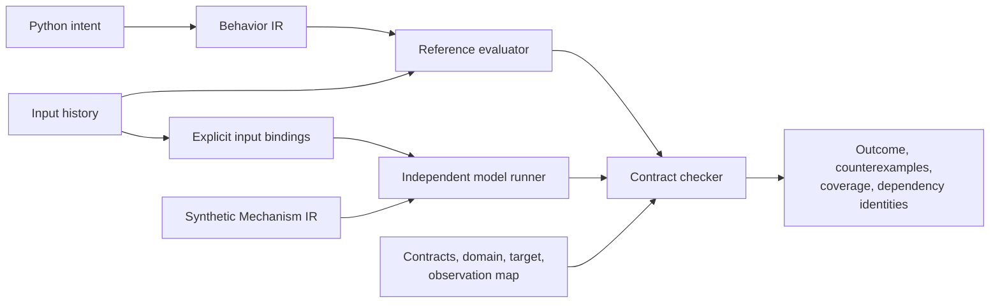

# Realization contracts and finite-trace checking

CellWeave can compare an abstract behavior specification with an independently executed candidate model. This is the first executable bridge below Behavior IR. Its initial model is a synthetic signal-processing graph, designed to test compiler semantics. It does not model molecular kinetics or generate sequences.

The pipeline has two branches that meet at a checker:



The candidate cannot choose its own acceptance criteria. The checker runs the reference evaluator and model separately, checks their observation mapping, and evaluates the supplied response contracts. Automatic candidate generation is implemented for the separately scoped combinational synthetic profile in `synthesis`; temporal candidate generation remains unsupported.

## Python entry points

The [executable example](../examples/realization_check.py) constructs every artifact and includes deliberately incorrect candidates. The public checking call is:

```python
result = cw.check_realization(
    behavior, contract, domain, target, candidate, observation_map, history,
    until=7,
)
print(result.outcome, result.coverage, result.counterexamples)

# Compare identities before reusing an earlier result.
current = cw.realization_dependencies(
    behavior, contract, domain, target, changed_candidate, observation_map,
    history, until=7,
)
print(result.freshness(current).changed_dependencies)
```

| Artifact | Principal fields |
| --- | --- |
| `Observable` | Semantic endpoint `id`, `dtype`, exact behavior `role` node ID, `scope`, `compartment` |
| `InputDomain` | Behavior `signal_id`, explicit observation `field`, `observable`, allowed Boolean values or typed `Interval` |
| `OperatingDomain` | `id`, `version`, `role`, `inputs`, typed `minimum_horizon`, optional `max_contacts`, required capabilities |
| `ResponseRequirement` | `id`, `rule_id`, installed action `specification_id`, output `observable`, active/inactive ranges, activation/deactivation delays |
| `BehaviorContract` | `id`, exact semantic `behavior_fingerprint`, complete response requirements for the selected role |
| `TargetContext` | Context identity/version, DNA/RNA format, declared capabilities, compartments, typed resource assumptions |
| `MechanismNode` | Node `id`, operator `kind`, output `Observable`, input node IDs, typed operator attributes, requirement IDs |
| `MechanismProgram` | `name`, validated nodes, declared output node IDs, required capabilities |
| `ObservationMap` | `InputBinding(signal_id, field, mechanism_input_id)` and `OutputBinding(requirement_id, mechanism_output_id)` records |
| `CheckResult` | Outcome, evidence kind, scoped claim, diagnostics, per-requirement coverage, counterexamples, dependencies |

Top-level artifacts support `to_json()`, `from_json()`, and `fingerprint`. `cellweave inspect artifact.json` reports identity and summary; `--json` prints the validated normalized artifact. JSON is data: inspection never executes an authoring script.

Planning reports now emit `cellweave.plan.v0.2`, embedding the complete versioned `TargetContext` instead of the earlier three-field target reference. Existing three-argument Python construction of `TargetContext` remains supported. This change prevents capability, compartment, and resource assumptions from being lost during plan serialization.

## What the contract means

A response requirement binds an installed action in a specific behavior rule to an explicit output observable. The observable carries meaning as well as type: endpoint identity, engineered-cell role, cell or contact scope, and compartment. A dimensionally compatible signal is not automatically an equivalent endpoint.

The requirement specifies separate acceptable active and inactive ranges, with maximum activation and deactivation delays. In this profile the ranges are disjoint, finite scalar intervals. Values use the type system's canonical units. The contract points to the exact Behavior IR fingerprint. A changed behavior requires a new contract binding; the checker never silently retargets it.

The installed action identity matters. A duration wrapper and its underlying primitive action have different roles: the wrapper determines when the requested response is active. Binding only the primitive could erase a pulse's timing or conflate multiple uses of the same action.

This profile requires complete coverage of the selected role's installed ongoing outputs, and one-to-one mappings to declared model outputs. Instantaneous external reactions and quantitative output tracking require additional contract profiles. Internal state assignments remain executable through the reference evaluator. The checker reports unsupported semantics explicitly; it does not discard an output to obtain a pass.

An output observable is a declared readout. Connecting a synthetic output level to an action request tests that chosen readout contract. It does not establish a higher-level biological effect. Future adapters must explicitly justify each interpretation from measured or modeled quantities to the requested outcome.

## Domain and context

An operating domain declares the input fields that must be supplied, their allowed Boolean values or scalar intervals, a minimum observation horizon, and contact limits. Contradictory or empty declarations are invalid artifacts. Missing observations and histories outside the domain cannot support a passing result.

Domains must cover exactly the selected role's runtime observations. Unused signature metadata is excluded. Numeric observations arrive in canonical units; `present`, `high`, and `low` are independent explicit Boolean fields. The compiler does not infer a threshold or calibration relationship among them. Target resources are retained as assumptions and participate in identity; this profile does not perform resource accounting.

The target context identifies the payload format and versioned capabilities and compartments assumed available. A candidate's required capabilities must be provided by that context. This initial check is a declared capability match; it does not prove that a biological host has those capabilities. Domain, context, and model identities are retained with the result.

This profile checks one engineered-cell role. Each contact has an explicit object identity. A joint condition on one contacted object must be evaluated on that object before aggregation. Independent matching signals on different objects are distinguishable inputs, not interchangeable evidence.

## Two independent execution engines

The behavior evaluator implements the [language execution semantics](behavior-semantics-v0.1.md). Its output is a history of requested actions, state, and memory. It does not call the candidate model.

The synthetic runner evaluates a typed acyclic graph with Boolean logic, scalar comparisons, selection, explicit contact aggregation, and delayed signals. It does not call the behavior evaluator. Values are piecewise constant between events. Internal deadlines execute between external snapshots, and simultaneous external snapshots take precedence over due timers. A contact's disappearance clears its local model state.

Delays are **inertial**: a pending change is cancelled or replaced when its input changes before or at the deadline. A transient ending at or before the deadline can therefore be filtered out. This is a declared synthetic operator meaning, not an approximation of every molecular process. A future transport-delay or continuous model must declare its own semantics and version.

Graph edges carry typed values. Cell-scoped values may broadcast to contacts; reducing contact values to a cell value requires explicit aggregation. The graph rejects undeclared references, cycles, invalid operator signatures, and incompatible types or scopes.

## What a result establishes

The initial checker evaluates a **finite supplied history**, including internal model events, behavior events, and contract deadlines. It does not infer behavior between samples of an arbitrary numerical simulator: the synthetic runner supplies the complete piecewise-constant trajectory for its own model.

| Outcome | Interpretation |
| --- | --- |
| `pass` | The covered requirements satisfy the contract on this supplied history, under the recorded domain, context, mapping, and model. |
| `fail` | A counterexample or incompatible mapping prevents acceptance. |
| `unknown` | The history or assumptions are insufficient, outside the domain, or leave response obligations unexercised or unfinished. |
| `unsupported` | The request uses semantics the checker cannot interpret. |

A passing outcome is model-conditional evidence. It is neither proof for all possible histories nor empirical support for a biological implementation. An inactive history cannot establish required responsiveness, and an active-only history cannot establish shutdown. A passing result requires both active and inactive deadlines for every requirement, with no incomplete episodes. A silent implementation fails when an exercised response deadline passes; either unexercised response is unknown. This rule is enforced by the public checker and by strict result deserialization, not only by a synthesis wrapper.

After a desired state transition, the applicable delay defines the deadline for reaching the corresponding range. The checker enforces the range after that deadline while the desired state continues. It checks model transition times as well as deadlines so a temporary deviation between external snapshots is not missed. Short or truncated episodes that do not expose a response obligation cannot establish full coverage.

More precisely, traces are right-continuous, start at zero, and include the evaluation horizon. During a transition's grace period its new range is not yet enforced. Every completed active or inactive episode must reach a checked deadline; a transition exactly at the old deadline takes precedence and leaves that old episode incomplete. A contact's disappearance explicitly cancels its contact-scoped obligations and records cancellation; reappearance begins a new episode. It does not cancel cell-scoped obligations. Coverage records report active and inactive deadlines checked, incomplete episodes, and cancelled episodes.

Counterexamples identify the requirement, time, contact binding where relevant, expected range, observed value, and source correspondence. Coverage records distinguish an untested requirement from one that passed its exercised checks. The result's claim is scoped to the supplied contract, never automatically every possible obligation of the therapy.

## Identity and invalidation

Check records retain fingerprints for the behavior, contract, operating domain, target context, candidate model, observation map, input history, horizon, and checker/reference-evaluator/model semantics. Both semantic behavior identity and the full source-bearing behavior artifact identity are retained: changing a source location must not leave a diagnostic pointing to an old file while appearing fresh. Each artifact has an immutable, versioned representation and deterministic serialization.

Reusing evidence requires matching the dependency identities. A parameter change changes its containing model or behavior fingerprint. A changed target, mapping, domain, or input history likewise makes the old result stale. Rechecking is required; editing an old result does not make it evidence for the new candidate.

These identities prevent accidental reuse, not malicious certificate forgery. Serialized results are inspectable records of a run, not cryptographic attestations. Tool-version constants must change when execution or checking semantics change.

## Extending the profile

New operators need an independent reference meaning, validation rules, model execution semantics, and adversarial preservation tests. New adapters must declare applicability, units, observation meaning, uncertainty, dependencies, and whether their trajectory is complete or sampled. Unsupported cases must stay explicit.

The remaining obligations include uncertainty and population quantifiers, calibration provenance, continuous dynamics and solver error, calibrated biological composition and complete-payload realization. Declared component composition, offline linking, single-CDS construct assembly and exact DNA/RNA reference encoding now have separate checked profiles. The [toolchain contract matrix](toolchain-contracts.md) keeps these separate from the implemented finite-trace checks.

## Verification hardening in M8

The realization checker and synthetic acceptance versions are now `v0.2` to record
the shared active-and-inactive coverage policy. Historical results with only active
coverage cannot be imported as passing under the current result invariants.
`exercised_requirement_ids` identifies requirements with both kinds of deadline
checked; the individual coverage counts remain available.

The [semantic matrix](semantic-regression-matrix-v0.1.md) tests cross-operator time
and object-identity boundaries using literal expected timelines. The
[exploration tools](verification-exploration-v0.1.md) add explicitly bounded input
spaces, deterministic adversarial histories and failure-preserving reduction.
These are regression and exploration records, not a broader evidence kind or an
unqualified proof over arbitrary time, inputs or biology. The
[independence audit](verification-independence-v0.1.md) records shared declarations,
separate execution paths and the precise rejection gates exercised by mutations.
