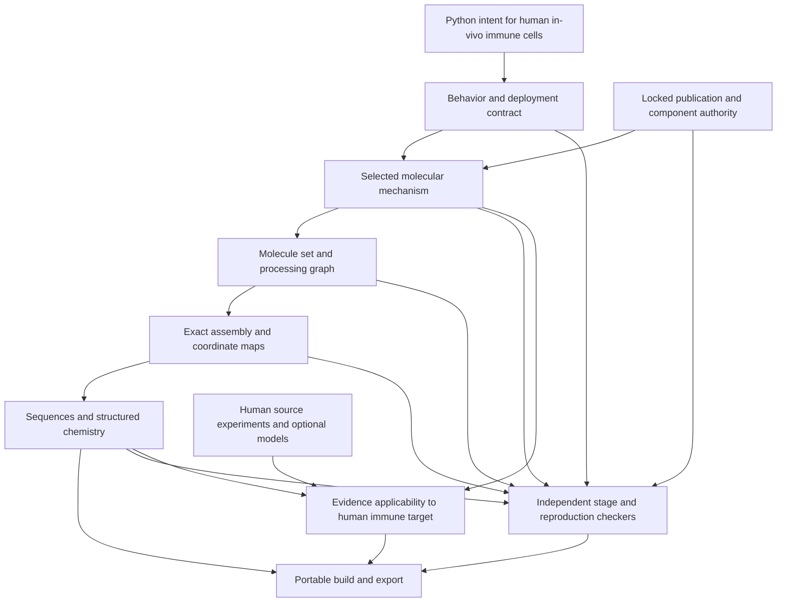

# Development plan: human immune-cell DNA/RNA payloads and RNA logic

Date: 2026-09-30. Baseline: `0.1.0.dev19`, merged revision
`0dbae3ca0e0821b64a3579f61a83aa15ee41be52`.

**Status: R0, R2 and R3 complete within their scope/claim contracts. R4 software
implementation awaits final hosted acceptance; R1 and R5–R13 remain open.**
R0 adds the scope and claim contracts documented in the
[profile guide](human-circuit-profile-v0.1.md). No literature record is promoted
to a verified molecular reference.
The [roadmap](roadmap.md) and [architecture](architecture.md) retain the existing
implementation and therapeutic-evidence boundaries.

## Product scope: human in-vivo immune-cell deployment only

The user's scope clarification is authoritative: **Biocompiler's only product
target is DNA/RNA payloads for immune cells engineered in vivo in humans.**
This is a hard constraint on authoring, selection, compilation and export, not
one selectable organism profile among several. There is no bacterial, yeast,
plant, animal-model or general-purpose cell-engineering product track, and no
non-human sequencing, genome-analysis or organism-specific optimization work.

Published experiments in human cell lines or primary human cells remain useful
for the previously requested exact-transcript reconstruction. They are
**reference benchmarks supporting the human immune-cell compiler**, not a
separate general cell-culture product. Keep their actual experimental context
separate from the intended deployment target. A HEK293 result, for example,
cannot satisfy an immune-cell or in-vivo evidence obligation by relabeling it.
Non-human experiments are excluded from the new benchmark implementation scope.

"Human" here describes recipient biology and deployment. Engineered payloads
may contain synthetic or heterologous components used in human-cell studies;
record their origins and assess their suitability for the declared human immune
context. Do not silently replace published parts with human-derived sequences
or equate endogenous origin with functional suitability. Component provenance
does not introduce a non-human recipient target or confer human-use eligibility.

Historical non-human software fixtures retain their original labels for
regression integrity only; do not expand them, expose them as product targets or
use them to satisfy the new human reference/acceptance gates. Cello contributes
software and interface inspiration only. Its bacterial biology and libraries
are not Biocompiler implementation targets.

## Completion contract

A researcher must be able to describe a human-cell study's molecular inputs,
Boolean response, output, experimental context and selected implementation in
Python; freeze that request; compile the complete set of specified RNA molecules;
and independently verify every emitted base and declared chemical feature against
the experimental source records. A different valid implementation of the same
truth table does not satisfy exact reproduction.

This reference capability must integrate into the primary human in-vivo immune
payload path. Product requests retain their human immune target, deployment,
required/prohibited behavior and evidence obligations through the same mechanism,
assembly and checking passes. Reference success alone does not complete the
product goal. The RNA-logic work must support explicit DNA-expression and RNA
payload forms relevant to that goal, with their distinct requirements intact.

The compiler must assemble the molecules from locked components and checked
transformations. Returning a stored final FASTA under a gate name is insufficient.
The reference transcript is an independent comparison target, not the compiler's
implementation. Missing information must identify the precise source gap and
prevent the affected exactness claim; it must never trigger a guessed sequence,
tail length, chemistry, processing event or experimental context.

The deliverable includes both a usable compiler and an independently curated
human reference collection spanning all mechanism families below. Researchers must
also be able to import their own authoritative human-study construct records through the
same public workflow. Completing schemas, artificial examples or one favorable
AND gate alone does not complete this plan.

Exactness has distinct scopes:

| Result | What a passing result establishes |
| --- | --- |
| Base identity | Every ordered base in each specified molecular form matches independently pinned authority. |
| Source-described nominal specification | Topology, modifications, cap and end/tail declarations match the documented specification, including explicitly reported uncertainty or distributions. Completeness is reported separately. |
| Complete exact nominal molecule | All required bases and molecular features are resolved and match for the requested individual molecular form; no required field or exact length remains unknown. |
| Source/mechanism correspondence | The authored requirement maps to the selected molecular interactions under explicit, checked family assumptions. |
| Model result | The selected model satisfies the specified observations within stated context, bounds and uncertainty. |
| Experimental correspondence | The source evidence concerns these material identities, inputs, observations and experimental conditions. |

These results are reported separately. A nominal specification cannot certify
the composition of an actual manufactured batch. A reported tail distribution
cannot be converted into one exact tail length. Identical RNA sequence does not
establish identical expression or reproduce an experimental outcome.

## Architecture to implement



Use the existing immutable requests, checked passes, requirement IDs, source maps,
registry locks and artifact infrastructure. Add versioned human circuit-family
and reference-checking profiles instead of broadening existing exact-CDS or
secreted-precursor profiles in place. Human reference reconstruction is an
evidence workflow through shared passes; it does not create a general research
target API. Keep compiler generation and acceptance implementations independent.

Three decisions are fundamental:

1. **Behavior does not determine bases.** `A & B` requires a selected mechanism,
   exact component variants, assembly rules and molecular context before it can
   determine a transcript. Exact reproduction locks all these choices.
2. **A circuit is a molecule set.** One output can require multiple coding and
   noncoding RNAs, host proteins, input molecules and processing intermediates.
   A single sequence field cannot represent the complete implementation.
3. **Sequence, processing and evidence are separate representations.** Assembly
   partitions each output base exactly once; semantic features may overlap.
   DNA templates, primary RNA, processed RNA, edited RNA and proteins have
   separate identities and checked relationships.

## Required benchmark collection

R1 must enumerate the actual human construct and experiment IDs from each study
before an individual case can be marked complete. Include every human-tested
logic-circuit variant in the agreed inventory, including human supplementary variants;
identify controls, inputs and assay references separately. Gate names below are
coverage requirements, not claims that complete final transcripts have already
been recovered. All entries are presently **unadmitted to this new profile**.
For mixed-species papers, curate only the relevant human experiments and the
source records necessary to identify their materials. Human non-immune cell
experiments establish a narrow mechanism/reference benchmark; they are not
product targets. Prioritize applicable primary human immune-cell evidence when
available and retain unmet in-vivo applicability obligations explicitly.

| Study / family | Required coverage | Reconstruction and claim boundary |
| --- | --- | --- |
| [Wroblewska et al., 2015](https://www.nature.com/articles/nbt.3301) | Published modified-mRNA logic implementations and their component inventories | Preserve the particular RNA-binding/effector fusion and target-site architecture; do not substitute the later MS2 implementation. Audit the supplement's configuration and sequence records. |
| [Matsuura et al., 2018](https://www.nature.com/articles/s41467-018-07181-2) | AND, OR, NAND, NOR, XOR and reported three-input AND; every circuit transcript and variant in the inventory | Human-cell delivered-mRNA benchmark. Distinguish L7Ae and MS2 layers, reporter species, input mimics and assay references. Transcript maps and primer lists need reconciliation into complete records. |
| [Fujita et al., 2022](https://pmc.ncbi.nlm.nih.gov/articles/PMC8730616/) and [Masaki et al., 2025](https://pmc.ncbi.nlm.nih.gov/articles/PMC12271581/) | Single-RNA ON and combined ON/OFF circuits, including the asymmetric Boolean response | Represent a post-poly(A) regulatory extension and original delivered RNA separately from proposed processed products. Preserve the evidence's uncertainty about the activation mechanism. |
| [CellREADR, 2022](https://pmc.ncbi.nlm.nih.gov/articles/PMC10348343/) and [RADAR](https://pmc.ncbi.nlm.nih.gov/articles/PMC12516989/) | RNA sensing, tandem-input AND and reported OR implementations, with separate study-specific cases | Keep the unedited sensor, conditional translation and edited state distinct. Human-cell DNA-expression experiments are not automatically delivered-mRNA benchmarks; transcript ends need their own authority. |
| [PROMITAR, 2023](https://www.nature.com/articles/s41467-023-43065-w) | IRES-mediated NOT/AND/OR variants and separately identified circular-RNA experiments | Complete plasmid records do not by themselves establish mature RNA boundaries, circular junctions or chemistry. Match each observation to its actual DNA, linear-RNA or circular-RNA deployment. |
| [Abe et al., 2025](https://www.nature.com/articles/s41467-025-60392-2) | Split-protein AND, NOR, both asymmetric two-input responses and reported three-input variants | Multiple RNAs encode interacting protein fragments. Protein splicing is not RNA splicing; retain precursor and assembled-product identities and each RNA's chemistry. |
| [Liu et al., 2018](https://elifesciences.org/articles/31936) | RNA-mediated translational gates, including XNOR, as a separate DNA-expressed profile | Include noncoding regulatory RNA and reporter RNA where the published circuit requires them. Do not count these experiments as direct synthetic-mRNA delivery evidence. |

Every case record also lists its unresolved transfer obligations to human immune
cells in vivo: input accessibility/activity, required host machinery, same-cell
delivery of circuit members, expression duration, output function, applicable
measurements and uncertainty. Those gaps do not prevent honest source
reconstruction; they prevent unsupported deployment claims. A study containing
both human-cell and animal experiments cannot combine them into stronger human
evidence. All table coverage is restricted to the human subsets described above.

Maintain separate coverage tables for Boolean functions, mechanism families,
molecular forms and experimental contexts. The frontend can express all 16
two-input Boolean functions, constants and projections without claiming that
each has a validated direct-mRNA implementation in human cells. More-input
parity, equivalence, thresholds and temporal requirements need explicit semantics
and capability checks; a truth-table demonstration is not evidence of reversible
real-time operation or memory.

## Ordered implementation work

Each package includes implementation, independently implemented checks, negative
tests, public examples and documentation appropriate to its scope. A package is
complete only when its acceptance gate passes on the recorded revision. Proposed
module names below are design targets, not existing public APIs.

| Package | Depends on | Main responsibility |
| --- | --- | --- |
| R0 | Existing baseline | Scope, invariants, profile and claim contracts |
| R1 | R0 | Publication authority, inventories and reference curation |
| R2 | R0; R1 identity schema | Typed Python authoring and observation semantics |
| R3 | R0; R1 authority schema | Molecular forms, assembly, features and chemistry |
| R4 | R1, R3 | Checked transformations, molecule sets and primitive verification |
| R5 | R2, R4 | Mechanism IR, functional correspondence and family interfaces |
| R6a | R1–R5 for one complete case | First complete vertical slice and stable family interface |
| R6b | R6a; source records for each case | Complete multi-mRNA logic suite |
| R7 | R6a; own source records | Post-poly(A) and combined ON/OFF mechanisms |
| R8 | R6a; own source records | RNA editing and conditional translation mechanisms |
| R9 | R6a; own source records | IRES regulation and circular-RNA forms |
| R10 | R6a; own records and relevant R4 transformations | Split-protein and noncoding-RNA circuit mechanisms |
| R11 | R6a; each selected family's completed checks | Candidate selection and model/evidence integration |
| R12 | R6a; integrate R6b–R11 as completed | Public build, verify, export and guided workspace |
| R13 | R0–R12 and completed human R1 inventories | Human immune-path integration, cross-family acceptance and release |

R1 is continuous curation: downstream packages need their own frozen schema and
case authority, not the closure of every unrelated study. R6a unlocks the family
work; R6b and the other case collections must all finish before R13 closes.

### R0 — Freeze the profile and completion contracts

Primary areas: `docs/decisions/`, `ir/`, `compiler/workflow.py`, `verification/`.

- [x] Write an architecture decision for human immune-payload circuit compilation
  and its supporting human reference workflow, covering
  exact reproduction, bounded candidate design, artifact forms, evidence levels,
  compatibility and the public request/result boundary.
- [x] Enforce human recipient identity (`Homo sapiens`, NCBI taxon 9606), in-vivo
  deployment and an explicit immune-cell recipient scope as product invariants.
  Use existing human target/deployment contracts; do not add a species selector
  or relax their in-vivo constraint for the product workflow.
  A free-text cell-subtype label alone is insufficient: require a checked immune
  recipient identity/eligibility obligation.
- [x] Represent source-experiment context separately: actual human cell line or
  primary cell, immune/non-immune identity, compartment, delivery/expression mode
  and assay conditions. Reference replay needs no invented therapeutic wrapper;
  its result is a reference artifact, never a replacement deployment context.
- [x] Reject non-human product targets and new non-human reference benchmarks.
  Check scope on import, planning, selection, fresh verification and export;
  arbitrary metadata labels cannot bypass it.
- [x] Specify independent status dimensions and diagnostics, retaining
  PASS/FAIL/UNKNOWN/UNSUPPORTED and explicit partial completeness. Unknown
  chemistry may coexist with proven base identity but cannot yield complete
  nominal molecular identity.
- [x] Freeze an initial family/case inventory policy, source licensing policy,
  review requirements, resource bounds and the R13 completion checklist. Record
  additions or removals explicitly rather than silently shrinking coverage.
- [x] Review low-fidelity workflow wireframes against the researcher tasks and
  Cello-inspired requirements below before freezing APIs. This is early product
  design; integrated UI implementation remains R12.
- [x] Define schema/profile versioning, migration and evidence-invalidation
  rules. Historical artifacts retain their original claims and verification
  versions; migration requires fresh checking.

**Acceptance:** only human in-vivo immune-cell product targets are supported.
Human source experiments can be represented faithfully as supporting evidence
without changing that target. Scope and claim-boundary tests reject non-human
targets and promotion based solely on schema or sequence success. The versioned
contracts and human benchmark inventory policy are reviewable.

**Implementation:** `0.1.0.dev20` adds the strict Python contracts, independent
checker, public API/CLI, executable example, authority-mutation tests and hosted
CI gates. No molecular backend is added.

[Hosted validation](https://github.com/logannye/biocompiler/actions/runs/36779026077)
passed all **1,082 tests (48 new)**, package installation, the new installed
profile example/check/verify/inspect workflow and every existing package gate
on Python 3.11.16 and 3.14.7, Linux x86_64
(`Linux-6.17.0-1022-azure-x86_64-with-glibc2.39`). The installed browser suite
also passed. Tested PR merge revision: `c32bc6afa7917afa3e4fd9fbe4006823a6ed1e97`;
implementation head: `f7dfd629fec20c4d595c51a36d6c3fb08686b109`,
[PR #27](https://github.com/logannye/biocompiler/pull/27). Local Python 3.14.6
on macOS arm64 also passed all 1,082 tests, Ruff, audit integrity and the new
example. No local package installation or native build was used.

### R1 — Curate independent publication and sequence authority

Primary areas: `registry/`, `ir/payload.py`, `verification/payload.py`,
`data/references/`, `tools/`; reuse retained-source and review infrastructure.

- [ ] Inventory each study's human main/supplementary construct IDs, variant names,
  figures, experimental input states, circuit molecules, controls, deposits,
  corrections and sequence files. Retain original bytes, retrieval/version
  metadata, source hashes, access/reuse terms and exact locators.
- [ ] Separate human immune-cell evidence from human non-immune mechanism
  benchmarks and classify in-vitro versus in-vivo observations. Record each
  source's applicability gaps to the intended immune recipient and deployment;
  do not add non-human gate libraries or animal-sequence reconstruction tasks.
- [ ] Implement strict, bounded import adapters for the source formats actually
  used: annotated sequence records, FASTA and tabular component/primer records.
  PDF extraction is a reviewed curation aid, not an unquestioned sequence oracle.
  Normalize alphabet/coordinates only through recorded transformations.
- [ ] Resolve complete component sequences, assembly order, junctions, transcript
  boundaries, topology and reported chemistry. Reconcile plasmid maps, oligos
  and primer recipes; flag conflicting or ambiguous characters and missing ends.
- [ ] Freeze component/recipe authority separately from independently curated
  final-molecule expectations. A second review must reconcile both against the
  original sources. Do not generate expected transcripts with the production
  assembler or copy their hashes from generated output.
- [ ] Create versioned case locks tying the Python-level response and input/output
  identities to a particular mechanism, molecule inventory, source expectations,
  observation context and review record. Authority includes content pins, not
  only a DOI, URL or a self-asserted provenance label.
- [ ] Provide an author-supplied import/review path for missing original records.
  Maintain a precise gap queue: e.g. unknown 3′ end, unresolved variant, cap not
  reported, or complete construct unavailable. Requesting records from other
  people requires explicit user authorization to send those messages.
- [ ] Retain published measurements at their actual resolution, including assay,
  time, normalization, replicates and uncertainty when available. Separate raw
  observations, digitized values and qualitative figure interpretation. Do not
  invent response thresholds from a plotted mean.

**Acceptance:** every inventoried case has either independently reviewed complete
authority or an explicit per-field gap. At least one complete fluorescent-output
case is ready before R6. All required inventory cases must have the authority
needed for their declared exactness scope before R13 can claim corpus completion.
Source retrieval happens during curation; regression tests run offline.

### R2 — Make Python intent precise and expressive

Primary areas: `frontend/api.py`, `frontend/expressions.py`, `ir/behavior.py`,
`semantics/types.py`, `semantics/context.py`, implementation requirement analysis.

- [x] Add circuit requirements to existing human therapy authoring and frozen
  request machinery. Keep `Therapy.engineer` and the product behavior validator's
  in-vivo constraint. Require explicit human immune-cell type/state, relevant
  tissue/compartment and deployment identity for product requests.
- [x] Add a bounded human-reference authoring/replay entry point using the same
  requirement and mechanism schemas with separate source-experiment metadata.
  It can recreate a published human-cell circuit without fabricating an immune
  experiment; its output cannot be passed off as an admitted deployment payload.
- [x] Carry the existing human behavior, deployment, prohibitions and admission
  contracts through circuit lowering. Model cell-accessible sensing, output
  lifecycle, payload modality and required co-delivery/provider relationships;
  missing refinements remain explicit and block strict product completion.
- [x] Add molecular observations with entity/isoform identity, quantity kind,
  compartment and scope. Distinguish miRNA activity, RNA abundance, protein
  abundance, ligand concentration, translation rate and downstream activity.
  `TypeSpec.compatible` currently ignores scalar names; use real nominal
  distinctions or an explicit observation schema, not decorative type names.
- [x] Bind HIGH/LOW to the case's encoding and observation contract, with units,
  allowed ranges or explicitly qualitative states, missingness rules and time.
  Preserve unknown/ambiguous states. Input mimic dose is not automatically the
  intracellular activity sensed by the circuit.
- [x] Introduce protein-expression/product and RNA-product requirements. Keep
  translation, mature protein quantity, reporter fluorescence and biological
  activity distinct. The existing instantaneous `report()` action cannot stand
  in for regulated protein expression.
- [x] Support compositional NOT/AND/OR/XOR/XNOR, asymmetric expressions,
  constants, projections and truth-table authoring through a canonical typed
  Boolean representation. Define multi-input parity/equivalence explicitly.
  Keep Python Boolean coercion forbidden and Python loops design-time only.
- [x] Preserve all source requirements, prohibitions, locations and wrapper
  contracts through analysis. Unsupported timing, feedback, state, secretion,
  delivery or output behavior remains an obligation rather than disappearing
  when a reporter circuit is selected.
- [x] Add explicit exact-reproduction and candidate-design request modes, with
  selected realization, authority lock, requested molecular form and fidelity
  scope. Freeze the API only after the R6 vertical slice exercises it.

**Implementation:** `0.1.0.dev22` adds the [typed circuit intent contract](circuit-intent-v0.1.md).
Requirements supplement the unchanged full source wrapper; every source obligation
remains conjunctive and unresolved at the molecular boundary. R2 uses the existing
source/evidence pin schema; R1 curation and its metadata-only draft remain open.
The API remains provisional until R6; this milestone establishes no published
reconstruction or molecular output. [Hosted validation](https://github.com/logannye/biocompiler/actions/runs/36784667535)
passed all **1,206 tests (124 new)**, package installation, installed circuit
intent example/check/verify/inspect workflows, every existing package gate and
the installed browser suite on Python 3.11.16 and 3.14.7, Linux x86_64
(`Linux-6.17.0-1022-azure-x86_64-with-glibc2.39`). Tested PR merge revision:
`3477ad090a1446f47e5f8617dfb1dc8ae6e76f1e`; implementation head:
`77f063d9be29e49256c4930e9577b21650a86ae3`, [PR #29](https://github.com/logannye/biocompiler/pull/29).
Local Python 3.14.6 on macOS arm64 also passed all 1,206 tests, Ruff, audit
integrity and the new example. No local native build or package installation
was used. This receipt identifies the tested implementation; subsequent
validation-documentation commits receive the same required hosted gates.

**Acceptance:** all 16 two-input Boolean functions round-trip with stable source
identities; quantity/compartment/entity mismatches fail; missing input states
remain unknown. An AND-to-OR edit with a locked AND realization is rejected.
Non-human or non-immune deployment edits are rejected by the product profile.
Human non-immune source metadata does not replace the immune target.
No frontend-only success is labeled molecular implementation.

### R3 — Generalize molecular identity without losing precision

Primary areas: `ir/molecular_design.py`, `ir/construct.py`, `ir/molecular.py`,
`ir/payload.py`, `ir/implementation.py`, `artifacts/`.

- [x] Introduce named molecule sets and identities for templates, primary RNA,
  delivered RNA, processed RNA, edited states, noncoding RNA, protein precursors
  and mature products. Represent noncovalent protein complexes by constituent
  identities and declared stoichiometry, not an invented concatenated peptide.
  Support linear and circular topology, multiple ORFs, uORFs and explicitly
  noncoding molecules.
- [x] Preserve complete DNA and RNA payload identities where supported for human
  in-vivo immune deployment. Distinguish a deposited cloning/template record from
  the requested delivered DNA or RNA; cloning hosts are provenance, not targets.
  Do not infer a complete DNA payload from an RNA cassette or vice versa.
- [x] Separate the ordered, disjoint assembly partition from overlapping
  annotations. A recognition site, CDS, stem, IRES and regulatory feature may
  overlap; each supplied residue still has exactly one declared assembly origin. Repeated
  motifs retain separate occurrence identities and coordinates.
- [x] Specify zero-based half-open sequence coordinates, strand/orientation,
  alphabet, biological 5′→3′ direction, coordinate-space identity and mappings
  between forms. Circular features may cross the nominated origin.
- [x] Add structured chemistry: canonical base sequence, modification identity
  and scope/position or documented substitution policy, cap, terminal groups,
  internal poly(A), terminal tail, exact length or documented uncertainty.
  Resolve I/inosine separately from G; an editing readout is not a base substitution
  license. Distinguish pseudouridine and N1-methylpseudouridine.
- [x] Define content identity for base strings, nominal molecules and whole
  circuit bundles. Stable ordering must not erase molecule multiplicity or
  distinct roles. Separate species identity, role instances, unique record IDs
  and experimental copy number/amount; one species may fill several roles when
  the locked implementation permits it. For circles retain the source origin
  and a separately defined rotation-equivalence identity; never silently rotate
  a requested reference.
- [x] Version all schemas, enforce strict parsing and size limits, and preserve
  legacy profile behavior. Add inspectable provenance for every feature boundary
  and chemistry declaration, including explicit unknowns.

**Implementation:** `0.1.0.dev23` adds the [declared molecule profile](circuit-molecules-v0.1.md).
Complete human authority remains attached; species, role instances, archival IDs,
experimental amounts and run metadata have separate identities. Supplied
spellings and nominal chemistry are declarations, not checked construction,
source correspondence or empirical evidence. Existing profiles stay unchanged.
Required hosted validation is recorded in the milestone pull request and the
external session receipt with the tested revision/platform.

**Acceptance:** round-trip examples represent a multi-RNA circuit, overlapping
features, a post-poly(A) extension, a circle, an internal conditional stop and a
noncoding RNA without inventing biology. One-base, cap, modification or tail
changes affect the correct identity; irrelevant run metadata does not.

### R4 — Implement checked transformations and molecule-set construction

Primary areas: `compiler/`, `backends/molecular_design.py`,
`verification/molecular_design.py`, `verification/construct.py`, `artifacts/`.

- [x] Implement independently checked primitives for source slicing,
  concatenation, orientation, explicit DNA-to-RNA transcription and declared
  RNA processing. No implicit T→U conversion or guessed transcription start/end.
- [x] Support RNA cleavage/splicing, circularization and base editing as distinct
  typed transformations; separately support translation, protein cleavage and
  protein splicing, noncovalent complementation and ribosomal skipping such as
  2A-associated product formation. Skipping is not proteolytic cleavage; retain
  the actual residues of every product. Every edge declares substrates, products,
  coordinates, assumptions and authority. These records describe specified processing, not
  a claim that every cellular molecule follows it.
- [x] Add per-family structural translation checks, including conditional
  translation and multi-ORF constructs. Preserve the existing ordinary-CDS
  validator's start/frame/terminal-stop requirements in its current profile.
- [x] Extend exact assembly to multiple named molecules, internal poly(A) and
  post-tail sequence. Replace global fixed-region assumptions only in the new
  profile. Build source maps for every output base and transformed feature.
- [x] Extend target-aware whole-molecule assembly/checking for the declared
  human DNA and RNA payload profiles. Retain the required regulatory regions,
  topology and delivery-form authority for each. Publish an explicit modality
  capability map; unsupported DNA/RNA forms fail rather than silently returning
  a template, a coding region or the opposite alphabet.
- [x] Write primitive and molecule-set checkers before admitting family emitters.
  Checkers consume frozen authority and reconstruct independently; they must
  not import the assembler, generator or emitted expected values.
- [x] Retain all required circuit members and distinguish delivered components,
  encoded products, host-provided dependencies, experimental inputs, controls
  and assay references. Ratios/amounts belong in the experimental manifest when
  known; they do not modify the nominal sequence identity.
- [x] Support strict complete-set output and explicitly scoped partial diagnostic
  inspection. A missing member cannot yield a complete circuit or a misleading
  successful synthesis/export handoff.

**Acceptance:** independent checks detect inventory omissions, unauthorized
duplicates, duplicate IDs, wrong orientation, off-by-one coordinates, incorrect
junctions and invalid chemistry.
All bases have complete provenance. Fresh reconstruction catches tampering even
when an attacker updates the package's self-reported hashes.

**Implementation:** `0.1.0.dev24` implements the bounded supplied-construction
profile described in the [R4 guide](circuit-construction-v0.1.md). Checked boxes
record the primitive software scope, pending exact-revision hosted acceptance
before milestone merge. Complete external root/operation authority is replayed
independently; strict complete-set JSON export retains all authority. No-product
conditional branches, alternative translation initiation and nonincreasing
splicing paths remain explicit unsupported cases. Later family authority must
supply functional refinements; declared complexes/regions do not prove binding
or regulatory function. All new fixtures are artificial controls. R1's unmerged
metadata draft, R5 family semantics and the source-backed R6 vertical slice stay
open. R4 export is not the R12 complete export system.

### R5 — Connect requirements to executable molecular-family semantics

Primary areas: `ir/implementation.py`, new circuit mechanism IR,
`compiler/implementation_requirements.py`, `compiler/`, `verification/`, `models/`.

- [ ] Define typed mechanism nodes and edges for recognition, binding,
  repression, activation, RNA loss/processing, editing, translation and product
  assembly. Resolve each required role to an exact sequence feature, molecule,
  host dependency or explicitly external input.
- [ ] Define a small versioned family interface: applicability/capabilities,
  accepted inputs/outputs, structural constraints, component slots, lowering,
  nominal rule semantics, independent checks and evidence requirements. Avoid a
  generic unrestricted rewrite engine that can silently assert arbitrary gates.
- [ ] Implement requirement-to-mechanism refinements with source correspondence
  for every operand, output and declared assumption. Distinguish one reporter
  species from summed/mapped outputs of multiple reporter transcripts.
- [ ] Independently derive each implementation's qualitative response from its
  checked interactions and bindings, then compare it with the requested truth
  table. A library field saying `gate="AND"` is not proof of correspondence.
- [ ] Check dependency identity, cellular co-location, provider scope,
  compartment and declared context. Retain unknown resource competition,
  delivery co-occurrence and kinetic assumptions; nominal compatibility does
  not validate them experimentally.
- [ ] Bind every proposed product mechanism to the specific human immune-cell
  state and deployment contract. Check input accessibility, regulator availability,
  co-payload/co-delivery obligations and output lifecycle in that context. A
  human non-immune benchmark supplies no automatic positive compatibility result.
- [ ] Keep endpoint Boolean semantics separate from dynamic models. Provide
  observation maps and optional model hooks; preserve unsupported timing or
  reversibility claims rather than interpreting them through an endpoint table.

**Acceptance:** an unbound sensor, wrong effector, wrong output map, missing host
dependency or conflicting cell context cannot pass complete correspondence.
The expected gate is derived independently of the generator and remains labeled
conditional on the family's explicit mechanistic assumptions.

### R6 — Deliver the first complete vertical slice, then the multi-mRNA suite

Primary areas: family implementations, publication registry, Python/CLI examples,
integration tests; reuse R1–R5 rather than adding a parallel special-case compiler.

- [ ] Select the first fully curated human fluorescent-output case based on R1
  source completeness, preferring immune-cell evidence where available. Exercise
  Python → requirements → mechanism → molecule set →
  exact RNA/chemistry → package → fresh independent reproduction in one workflow.
  This is **R6a**; its complete vertical slice and reviewed interface unlock R7–R12.
- [ ] In the same vertical slice, exercise an original human immune deployment
  request through circuit analysis and all applicable shared passes. Preserve
  the target and every unmet obligation. Verify strict refusal where only the
  reference study, rather than applicable immune/in-vivo evidence, is available.
- [ ] Implement the Matsuura L7Ae and MS2 layers as their actual mechanisms,
  including recognition-site placement, component variants and reporter mappings.
  Add AND/OR first, then NAND/NOR/XOR and the reported three-input construction.
- [ ] Implement Wroblewska's relevant mechanism variants separately; preserve
  the particular fusion and regulatory interactions rather than treating all
  MS2-containing records as interchangeable parts.
- [ ] Complete the inventories for every required gate/variant, including all
  required circuit transcripts and optional, explicitly requested experimental
  controls. Preserve study-specific chemistry and context per molecule.
  This is **R6b**. Include human-tested reporter and cell-fate output variants as
  separate cases, with their specific product/processing requirements; a
  fluorescent case does not stand in for a different actuator.
- [ ] Exercise semantic edits: gate changes, input rebinding, alternate output,
  changed component variant, swapped UTR and changed topology. An exact locked
  reproduction must reject changed intent or changed material; candidate mode
  later may select a different supported realization with new authority.

**Acceptance:** all inventoried R6 cases produce base-identical reference
transcript sets through real component assembly and independently checked source
semantics. Missing sequence/chemistry fields block only the claims they affect,
and those cases do not count as complete nominal reproductions. At least one
complete case runs through installed-package Python and CLI outside the checkout.

### R7 — Add single-RNA post-poly(A) and combined ON/OFF circuits

- [ ] Add the Fujita/Masaki family-specific layouts, internal poly(A), regulatory
  extensions and combined positive/negative input bindings.
- [ ] Preserve the experimentally delivered transcript separately from proposed
  cleavage products and mature active states. Record alternative/uncertain
  mechanisms rather than choosing one without source support.
- [ ] Check asymmetric input polarity and feature positions, with an explicit
  response map for ON, OFF and combined ON/OFF variants.
- [ ] Complete independent source curation and the full Python-to-export case
  suite, including exact chemistry and molecular-form selection.

**Acceptance:** a post-poly(A) regulatory region survives exact emission; moving
it into an ordinary 3′ UTR or emitting a processed product in place of delivered
RNA fails. Both asymmetric Boolean bindings and uncertainty about mechanism are
reported correctly.

### R8 — Add ADAR sensing and conditional translation

- [ ] Add separate CellREADR and RADAR adapters with locked sensor regions,
  target identities, reading frames, input composition and host dependencies.
- [ ] Emit the source's unedited sensor, including its conditional stop codon;
  represent edited molecular states and their translation interpretation through
  explicit editing transformations. Do not replace the sensor stop codon with
  a constitutively translated codon during assembly.
- [ ] Support tandem sensing and multi-transcript OR only where each case's
  actual implementation uses those mechanisms. Preserve every input's binding
  and all required edit sites, including incomplete-edit states where modeled.
- [ ] Keep DNA-expression constructs, their known transcript intervals and any
  separately supported delivered-RNA cases distinct. Unresolved RNA ends prevent
  complete transcript reproduction even when sensor-cassette identity is known.
- [ ] Add tests for editing-site mismatch, wrong target/isoform, frame error,
  inosine/G conflation and missing ADAR/context declarations.

**Acceptance:** original and edited molecular identities cannot be confused;
conditional product identity is checked independently. Documented AND/OR cases
pass the end-to-end workflow only within their declared molecular-form and
experimental evidence scopes.

### R9 — Add IRES control and circular RNA

- [ ] Implement PROMITAR's study-specific IRES/recognition/structural features,
  overlapping annotations and bicistronic or other required coding layouts.
- [ ] Resolve full deposited templates into checked transcript forms only when
  boundaries and transformations are documented. Maintain a DNA-expression case
  independently of any circular-RNA delivery case.
- [ ] Implement circular precursor/product relationships, junction-crossing
  features, topology checks, source-origin preservation and explicit rotation
  comparison. Cap/tail declarations must be compatible with the requested form.
- [ ] Retain source-reported structure and functional evidence without treating
  a sequence motif or predicted secondary structure as proof of IRES activity.
- [ ] Complete the NOT/AND/OR and separately inventoried circular case suites.

**Acceptance:** exact circular junction and topology are reproduced; a linear
precursor cannot satisfy a circular-product request. A circular sequence can be
compared under a declared rotation policy without losing original source
coordinates, and no DNA-only experiment becomes circular-RNA evidence.

### R10 — Add split-protein and noncoding-RNA circuit families

- [ ] Implement the Abe split-protein/split-intein component and product maps,
  with independently verified precursor translation and mature-product assembly.
  Preserve fragment identities, splice/junction coordinates and per-RNA chemistry.
- [ ] Complete AND/NOR, both asymmetric responses and reported three-input
  variants, retaining protein and miRNA inputs as different observation types.
- [ ] Add Liu's RNA-mediated translational-control variants as a separate
  family, including noncoding regulatory transcripts, their interactions and
  the appropriate expressed reporter. Include the reported XNOR cases without
  implying a direct synthetic-mRNA XNOR demonstration.
- [ ] Validate complete molecule/dependency inventories and the distinction
  between RNA processing, protein splicing and complementation for every variant.
- [ ] Run source-linked Python-to-package integration and omission/mismatch
  tests for each family, not just standalone motif or protein checks.

**Acceptance:** every required fragment/transcript is present and correctly
bound; a compatible final protein cannot hide an incorrect source RNA. Swapping
split components, removing a regulatory RNA or conflating RNA/protein processing
fails independent verification.

### R11 — Add bounded design and separate predictive/evidence assessment

Primary areas: `synthesis/`, `registry/`, `models/`, `verification/` and existing
bounded-selection infrastructure.

- [ ] Expose candidate design as a distinct request mode over a finite, locked,
  versioned mechanism/component library for human in-vivo immune payloads. Check
  target eligibility, family capabilities, context and
  hard requirements before ranking feasible candidates by declared preferences.
  Preserve every considered alternative and rejection; do not claim global
  optimality or biological infeasibility after a bounded search.
- [ ] Rank evidence applicability to the declared human immune recipient and
  deployment before design preferences. Keep reference-only parts inspectable
  but ineligible for claims they cannot support. A human-cell-line result cannot
  be used as an immune-cell or human in-vivo calibration dataset without a
  separately justified mapping and the required independent evaluation.
- [ ] Keep exact reproduction immutable: no codon optimization, synonymous
  replacement, target retuning, spacer redesign, chemistry substitution, Boolean
  refactoring or optional default part. Any design change creates a new identity
  and a clear difference report against its reference.
- [ ] Make source-to-sequence edits observable: a supported candidate edit changes
  the selected implementation and affected bases/features, or returns an explicit
  unsupported/unsatisfied result. A stored reference cannot be returned under
  changed intent merely because the output protein remains the same.
- [ ] Add model adapters consuming the actual selected sequence/component and
  context identities. Carry uncertainty, domains, time bounds and observation
  mappings; distinguish mean population readouts from single-cell claims.
- [ ] Implement supplied-observation replay and evidence applicability checks.
  Where quantitative models/data exist, separate fitting/calibration from held-out
  evaluation. Source correction, sequence/chemistry changes and context shifts
  invalidate affected evidence rather than inheriting a published PASS.
- [ ] Return explicit unassessed/unsupported prediction for families without a
  supported model. Exact sequence reproduction must not depend on inventing a
  complete cell simulator, and model execution alone must not imply validation.

**Acceptance:** exact mode refuses any substitution, including synonymous changes.
Bounded candidate mode explains selections and rechecks every affected obligation.
Evidence applicability changes after material/context edits. Conditional rule
checks, model predictions and empirical support remain separately inspectable.

### R12 — Integrate public workflows, exports and the guided workspace

Primary areas: `compiler/workflow.py`, `__init__.py`, CLI, `artifacts/`, studio,
`examples/` and user documentation.

- [ ] Add the frozen circuit request to public `bc.compile(...)` dispatch and
  expose one consistent build/inspect/verify/export workflow in Python and CLI.
  Return field/source-linked diagnostics for every unsupported obligation.
- [ ] Integrate the human target/behavior/deployment/acceptance wrappers and
  admission checks into that workflow. Make human-reference reconstruction a
  clearly scoped supporting operation. Complete deployment export requires its
  own current authority and satisfied completion/admission gates; reference
  export cannot bypass them.
- [ ] Package original request authority, library/source locks, mechanism,
  molecule set, sequence/feature maps, structured chemistry, evidence identities
  and independent results. Keep timestamps/platform/run metadata outside
  canonical molecular/build identity; publish validated archives atomically.
- [ ] Verify in a fresh process against independent expected request/reference
  authority. Reconstruct with current checkers; ignore imported success flags.
  Include source/version and checker-version mismatches in the diagnostic report.
- [ ] Provide deterministic per-molecule and multi-FASTA exports with unambiguous
  identifiers, annotated sequence export where representable, and a complete JSON
  manifest for chemistry/provenance that FASTA cannot express. Keep DNA templates,
  delivered RNA and diagnostic intermediates visibly distinct.
- [ ] Provide a readable source-to-feature/sequence diff and mechanism/molecule
  map. Make completeness, exactness scope and missing material records visible
  before export; freshly verify authority at export time.
- [ ] Integrate the same request and checking path into studio: profile selection,
  case import, molecule selection, sequence/chemistry inspection, evidence and
  verified downloads. Invalidate displayed results after edits; reject stale
  responses and downloads. No second compiler inside the UI.
- [ ] Implement and test the Cello-inspired workflow below, including linked
  views, library inspection, explicit input/output mapping, candidate comparison
  and conditional availability of prediction plots.
- [ ] Publish executable authoring examples and an author-supplied-record tutorial.
  Each example states what is established and what remains unknown; no fabricated
  study files or unofficial API shown as an implemented feature.

**Acceptance:** a researcher using an installed package outside the source tree
can author, freeze, compile, inspect, verify and export every admitted case offline.
Python, CLI and UI agree on identities and statuses. Partial cases remain useful
to inspect while incomplete exports cannot be mistaken for complete reproductions.

### R13 — Complete human immune-path integration and release

- [ ] Demonstrate circuit requirements authored through a human immune program
  with the original target, deployment and acceptance contracts retained through
  selection, molecule generation, checking and export/refusal. Cover supported
  DNA and RNA forms explicitly; a successful reference-only example is
  insufficient integration acceptance.
- [ ] Test recipient type/state, tissue, modality, exposure and co-delivery edits
  against context applicability and evidence invalidation. Missing immune/in-vivo
  support must yield the precise unresolved obligation and strict refusal, not
  a substituted generic human-cell profile.

- [ ] Run the full case matrix from actual high-level Python to all independently
  pinned output molecules. Compare every base and every required chemistry/form
  field. Test all experimental input combinations within each declared response
  contract; distinguish software correspondence from observed biological behavior.
- [ ] Complete the mutation matrix below, independent-checker import/dependency
  audit, strict importer tests and reproducibility/authority checks. Set practical
  molecule/sequence/graph/archive limits and retain useful failure evidence.
  Exercise fresh verification with producer functions disabled where practicable,
  and compare canonical bundles across Python versions and relocated workspaces.
- [ ] Verify every scoped R1 case has its required reviewed source records. If a
  paper omits complete RNA identity, retain that unresolved gate and accept later
  author-supplied authority through the same workflow; do not report full corpus
  completion while required cases remain source-limited.
- [ ] Extend, rather than replace, current CI: full existing regression suite,
  package install, Python 3.11/3.14 examples and installed CLI reconstruction,
  benchmark-audit integrity and installed studio browser acceptance. Record exact
  revision, platform, checker/profile versions and retained acceptance artifacts.
- [ ] Add installed-package cross-family examples to CI with all reference inputs
  pinned and available offline under permitted reuse. No live network or mutable
  repository lookup supplies a test oracle.
- [ ] Complete an independent researcher walkthrough: choose a documented case,
  express its response in Python, build all transcript payloads, verify against
  original records, inspect a rejected edit, then import a new authoritative case.
- [ ] Update README, architecture, public API/profile documents, examples,
  migration/release notes, roadmap and handoff. Mark the implemented reference
  and human immune-path software scopes separately. The sole product goal remains
  open until its M11–M16 biological and complete-payload gates are satisfied;
  the benchmark release cannot be presented as fulfillment of that goal.

**Acceptance:** all required cases, interfaces and adversarial checks pass at one
recorded release revision. Release notes identify exactly which transcript/base,
nominal molecule, mechanistic and empirical claims are supported for each case.
No remaining source gap is hidden behind a software completion label. Complete
human in-vivo immune payload capability requires applicable evidence and all
original target/deployment obligations; neither benchmark completion nor correct
refusal alone establishes that capability.

## Cello-inspired UI/UX workstream

The user's requested reference is [CIDAR Lab's Cello page](https://www.cidarlab.org/cello).
Its published screenshots show a code/input/output design screen and result views
with a gate graph and predicted distributions. Its feature description includes
custom constraint libraries, characterized-gate assignment and alternative DNA
layouts. These are useful patterns for making compilation inspectable. The
[original Cello documentation](https://github.com/CIDARLAB/cello) also describes
truth-table, expression and structural authoring, response-function matching and
constrained layout generation. The [v2 repository](https://github.com/CIDARLAB/Cello-v2)
separates the compiler from its web application and identifies distinct sensor,
output-device and constraint inputs.

The [official usage guide](https://github.com/CIDARLAB/cello/blob/develop/RUN.md)
documents library validation, completed jobs and result-file retrieval; the
[Cello 2.0 paper](https://www.nature.com/articles/s41596-021-00675-2) documents its
editor/input/output panes, results interface and annotated sequence outputs.
These support an inspectable saved-build workflow as well as an initial wizard.

These observations come from the published page, screenshots and official
repositories reviewed on 2026-09-30. The live public landing page led to sign-in;
an authenticated Cello workflow was not tested. The following table is our
proposed Biocompiler adaptation, not a claim that Cello implements these RNA or
evidence features.

| Cello pattern | Biocompiler adaptation | Work and acceptance |
| --- | --- | --- |
| Logic specification alongside biological inputs and outputs | Linked Python/frozen-request view, Boolean expression or truth table, and explicit molecular input/output bindings | R2/R12: one canonical typed contract; no loss of entity, quantity, context or observation semantics when switching views. |
| Constraint-library selection | Inspectable, versioned mechanism/component/evidence bundle selector and author-supplied bundle import | R1/R11/R12: show compatibility, source coverage, supported context and locked identity; incompatible selections have actionable reasons. |
| Boolean circuit diagram | Linked views of logical requirements, molecular interactions and the complete transcript set | R5/R12: selecting a gate or interaction highlights all implementing molecules/features and their source requirements. A logical gate can map to several RNAs. |
| Response-function and per-state result plots | A truth-table inspector with separate expected, model-predicted and source-observed results; curves/distributions only when supported | R11/R12: show units, assay/time/context, thresholds and uncertainty. Missing model/data renders an explicit unavailable state, never fabricated curves. |
| Assignment exploration and alternative layouts | Candidate comparison with hard-constraint failures, declared preferences, sequence/chemistry differences and evidence applicability | R11/R12: exact reproduction stays locked; creating a derivative is an explicit mode change with new identity. |
| Complete design output | Per-transcript feature maps, processing graph, topology/chemistry panel and verified bundle export | R3/R4/R12: every diagram and download derives from the checked artifact; circular origins and overlapping annotations remain inspectable. |

Use these patterns to implement six connected researcher tasks:

1. **Define the human immune target.** The main workspace is “Human immune
   payload,” with human in-vivo deployment fixed. Choose the immune-cell type,
   state, tissue context and DNA/RNA form. A secondary “Human reference
   validation” workflow inspects/recreates published human experiments and keeps
   their actual source context visible. It never changes the product target.
   Surface missing target or source fields early with a path to supply them.
2. **Define the response.** Bind biological inputs and products and review the
   intended truth table. Show a Python view and allow export of executable DSL
   source. General Python authoring continues through the normal authoring
   process; the browser does not execute arbitrary pasted Python on the server.
   An imported request that the visual editor cannot represent remains lossless
   and read-only, with a clear reason.
3. **Inspect the implementation.** Select or inspect a locked realization and
   its dependencies. Link logical gates to actual interactions and molecules.
   Show the selected library/context assumptions and why alternatives were
   rejected. Preserve original source and derivative provenance.
4. **Inspect each RNA.** Offer a searchable transcript list and feature map,
   annotated bases, chemistry, topology and processing state. Selecting a base
   interval reveals its component/assembly origin and source locator; selecting
   a requirement reveals the implementing intervals across all relevant RNAs.
5. **Review verification and evidence.** Present separate base, nominal molecule,
   mechanism, model and experimental results. Each failure opens the specific
   source field, graph edge or sequence interval. A successful sequence comparison
   cannot hide a missing transcript end, measurement or model.
6. **Export and compare builds.** Save/reopen immutable builds and compare source,
   sequence, chemistry, context and evidence changes. Export the whole verified
   set or an explicitly selected molecular form, with clear completeness and
   reproducibility metadata.

Progressively disclose advanced assembly and model details, while keeping input
identity, output meaning, source gaps and verification scope visible. Keep long
sequences out of the initial overview. Provide keyboard navigation, labeled
controls, color-independent statuses and a readable small-screen layout. Preserve
drafts and focus when validation reports a problem. A running build shows its
actual stage and can be cancelled without publishing partial results; obsolete
responses cannot overwrite the active request.

Additional R12/R13 UI acceptance tasks:

- [ ] Round-trip supported visual edits, exported Python and frozen JSON to the
  same semantic contract and canonical molecular bundle. Source text identity may
  differ, but no binding, assumption or requirement is dropped.
- [ ] Walk from a truth-table output through its mechanism to every affected
  transcript region and the original source locator; test the reverse path too.
- [ ] Present a multi-transcript XOR, a post-poly(A) RNA, an edited sensor and a
  circle without reducing any of them to a misleading single linear cassette.
- [ ] Compare two candidates and show why each is eligible or rejected; retain
  rejected alternatives. Exact reproduction offers no silent “optimize” action.
- [ ] Test missing chemistry, unsupported context, absent model, unavailable
  observations, validation failures, cancellation, save/reopen and stale results.
- [ ] Expose no non-human organism selector or bacterial gate library. Verify
  that a non-human imported target is rejected, a human non-immune study is
  labeled reference-only, and deployment exports preserve the original immune
  target and its outstanding evidence obligations.
- [ ] Use real checked artifacts in browser tests and assert equality with CLI
  exports; visual snapshots alone are insufficient. Retain screenshots for the
  researcher walkthrough and verify keyboard/status accessibility.
- [ ] Provide a keyboard-accessible table alternative for each graph. Importing
  a package validates its data and provenance without executing code or fetching
  arbitrary dependencies. Reopening a historical result preserves its original
  fingerprints and requires fresh verification for new claims.

Cello's bacterial promoter units, fitted transfer functions and NOT/NOR
implementation basis are not default models for human RNA circuits. Preserve
Biocompiler's Python frontend and multiple mechanism families; borrow the
interaction patterns, then populate them with evidence for the selected RNA
implementation. UCF-style bundles are architectural inspiration, not an implicit
promise of UCF format compatibility. Any future code reuse needs an explicit
license/dependency review; this plan requires no Cello installation or service
dependency.

## Proposed researcher-facing API

This is the supporting human-reference acceptance target to refine during R2/R6,
**not currently executable**. Product authoring remains a human immune therapy
program with its target, deployment and acceptance contracts. These wrappers
must enter the shared circuit pipeline without being replaced by the case's
experimental context.

The case identifier and file below are placeholders until R1 establishes actual
construct IDs and reviewed authority. Users can also author the realization from
explicit imported components; publication-case loading is a convenience over the
same inspectable objects, not a sequence lookup shortcut.

```python
import biocompiler as bc

case = bc.PublishedHumanCircuit.load("references/study/and_case.lock.json")
circuit = bc.HumanCircuitBenchmark(
    "reproduce_published_and",
    experimental_context=case.experimental_context,
)

a = circuit.input.mirna(
    case.inputs["A"].entity,
    quantity="activity",
    logic_encoding=case.input_encodings["A"],
)
b = circuit.input.mirna(
    case.inputs["B"].entity,
    quantity="activity",
    logic_encoding=case.input_encodings["B"],
)
output = circuit.output.protein(case.products["reporter"])
output.require_logic(
    high_when=a.high() & b.high(),
    otherwise="low",
    response_contract=case.response_contract,
)

request = bc.HumanCircuitBenchmarkRequest(
    source=circuit.freeze(),
    realization=case.realization,
    fidelity="exact_reproduction",
    output_form="delivered_rna",  # Only for a case with this documented form.
)
build = bc.compile(request)
verification = bc.verify_reproduction(build, authority=case.reference_authority)
```

The case records must expose their source/construct IDs, pinned components,
transformation recipes, dependencies and source gaps to inspection. The output
contains named molecules and separate verification dimensions, not a single
Boolean `verified`. Building the same request and authority must produce the same
canonical sequence/chemistry bundle across supported platforms.

## Required regression and independence matrix

| Mutation or boundary | Expected result |
| --- | --- |
| AND intent changed to OR with the original realization lock | Mechanism/requirement mismatch; no accepted exact reproduction. |
| Equivalent `A & B` versus `B & A`, or a display-label rename | Preserve the corresponding biological identities and allow identical molecules; retain distinct source provenance where it changed. |
| Input entity, isoform, polarity, compartment or quantity changes | Correct remapping only under new supported authority; otherwise rejection/unknown. |
| Correct protein but synonymous nucleotide or UTR change | Exact base identity fails; protein equality cannot substitute. |
| Missing circuit member, duplicated ID or control silently used as a circuit member | Inventory/role mismatch. |
| Wrong source variant, orientation, one-base boundary or junction | Independent source/assembly comparison fails. |
| Regulatory feature overlaps a CDS or structure | Valid when authorized; overlapping annotation must not duplicate emitted bases. |
| Post-poly(A) extension dropped or moved | Full molecule identity fails. |
| Edited state emitted instead of original ADAR sensor | Requested molecular form/base identity fails. |
| Conditional-stop sensor sent to the ordinary continuous-CDS path, or silently repaired | Diagnose the wrong profile; preserve original bases and use separate conditional translation checks. |
| Inosine treated as guanosine without a declared interpretation | Chemistry/edit semantics fails. |
| Circular product replaced by precursor; origin rotated silently | Form mismatch or exact-source identity mismatch; explicit rotation equivalence remains separate. |
| RNA/protein processing confused or required fragment omitted | Transformation/product correspondence fails. |
| Cap, modified base, tail or chemistry-policy mismatch | Nominal identity fails even if canonical bases match. |
| Tail/ends/chemistry not reported by the source | Explicit unknown and restricted fidelity scope; no invented defaults. |
| Changed sequence, context, source correction or library version with old evidence | Dependent lock/evidence invalidation and fresh review/check. |
| Forged PASS fields or changed archive plus recomputed self-hashes | Fresh external-authority reconstruction rejects the mismatch. |
| Missing measurements, threshold ambiguity or only one response state covered | No complete behavioral assessment; preserve unknown/coverage failure. |
| Human cell-line experiment relabeled human in-vivo admission | Scope/admission refusal, regardless of sequence equality. |
| Non-human recipient or new non-human benchmark imported | Out-of-scope rejection; no new organism profile or deployment artifact. |
| Human non-immune experiment replaces the intended immune-cell target | Preserve the original target; reject the substitution and retain the applicability gap. |
| Reporter or multi-mRNA reference used to discharge therapeutic output, shutdown or same-cell in-vivo delivery | Keep those target obligations unresolved unless separately implemented and supported. |
| DNA-expression evidence reused as direct RNA-delivery support, or RNA copied into a purported complete DNA payload | Modality/form mismatch; require independent form authority and applicable evidence. |
| Synthetic/heterologous part origin confused with recipient species | Preserve exact reference and part provenance; evaluate human immune suitability separately without substituting parts or granting eligibility. |
| UI edit followed by a stale successful build/download | Stale identity rejected; current authority must be verified. |

Checker tests must not mirror the implementation by calling the generator to
obtain expected results. Use separately curated original records, independent
small reference cases, deliberate counterexamples and metamorphic properties
whose expected outcomes are specified without production code. Share immutable
schema definitions and basic parsing utilities only where they do not conceal
the acceptance decision or recreate the same algorithmic failure.

## Execution sequence and review boundaries

Begin today with R0 and the all-study R1 source inventory. Start source acquisition
early because missing material records can determine the critical path even when
the software is ready. Implement R2 and R3 in parallel after their shared identity
contracts are agreed, then R4/R5 and the first R6 vertical slice. Review the public
API against that real case before extending all family adapters.

After R6a, R6b and R7–R10 can proceed in parallel behind the frozen family/checker interface;
R1 curation continues for each family. Start R11 and R12 against R6a, then require
each additional family to pass the same integrated checks. R13 closes the entire
inventory and release, not merely the first successful branch.

Use coherent, reviewable PRs: profile/authority contracts; typed authoring;
molecular forms/chemistry; primitive construction/checking; mechanism semantics;
first vertical slice; remaining multi-mRNA cases; one PR series per additional
family; candidate/model integration; public tooling/UI; complete acceptance.
No fixed one-PR-per-package rule should force oversized changes. Each PR records
which gate it advances, its tested revision/platform and outstanding source gaps.

Keep runtime dependencies small. Prefer bounded plain-data schemas and explicit
adapters over a general plugin framework until a second actual implementation
requires abstraction. Keep sequence retrieval and curation tools outside the
deterministic compiler path; keep scratch/download/generated files out of source
control except reviewed, permitted reference evidence.

Local editing and static checks remain local. If native dependencies or Rust are
introduced, follow the [native build policy](../AGENTS.md#native-build-storage):
hosted CI or an already authorized remote environment by default, no implicit
local compilation or dependency rebuild. Preserve all existing validation gates.

This work advances the sole human in-vivo immune-cell product across existing
M8/M9/M11–M15 infrastructure; human reference reproduction is its supporting
verification track. It does not renumber or complete those therapeutic milestones.
Integrating the richer representations and checks into the human target path is
required in R2, R5, R6a, R12 and R13, not optional later reuse. Applicable biological
evidence and complete-payload admission remain necessary to complete the product.
